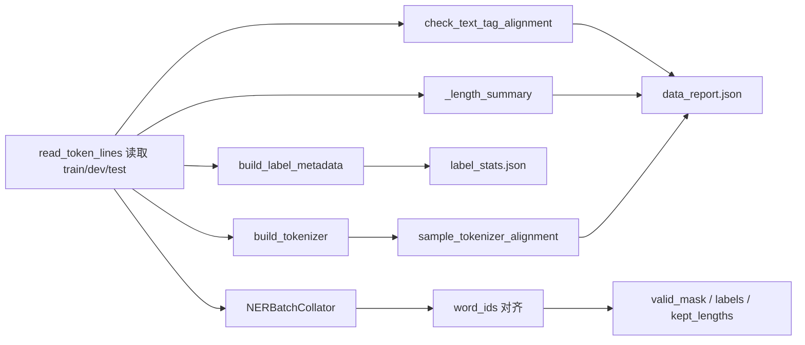
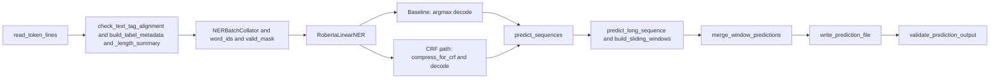
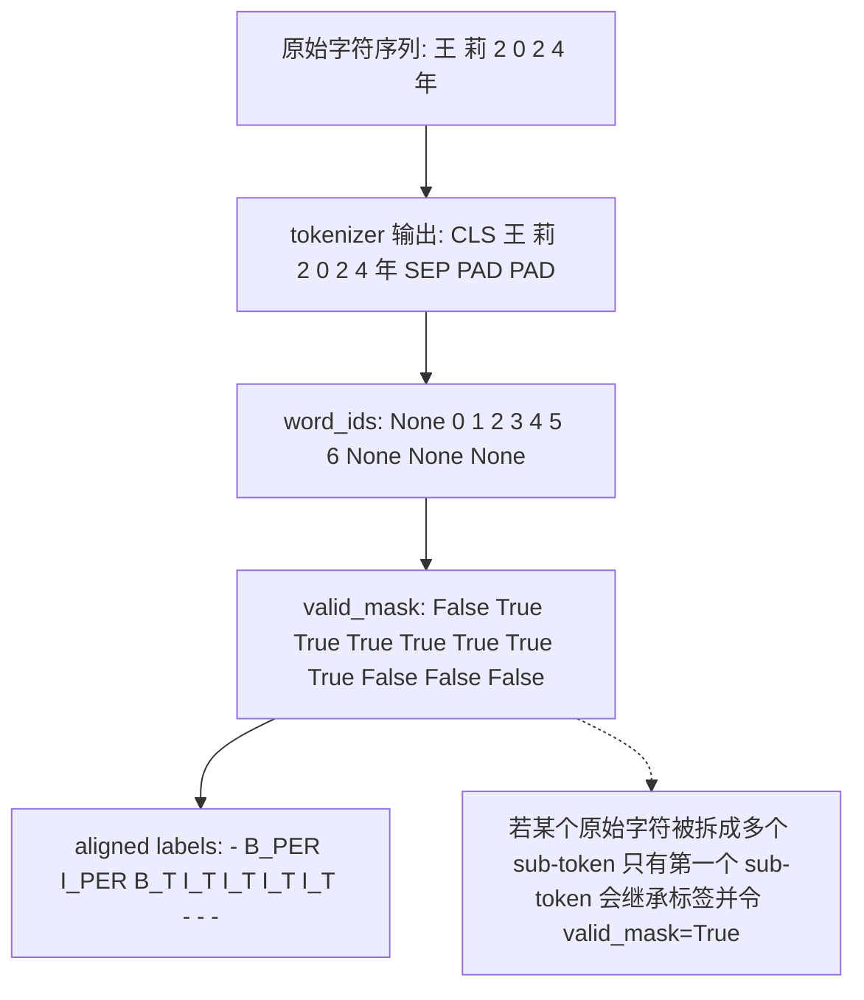
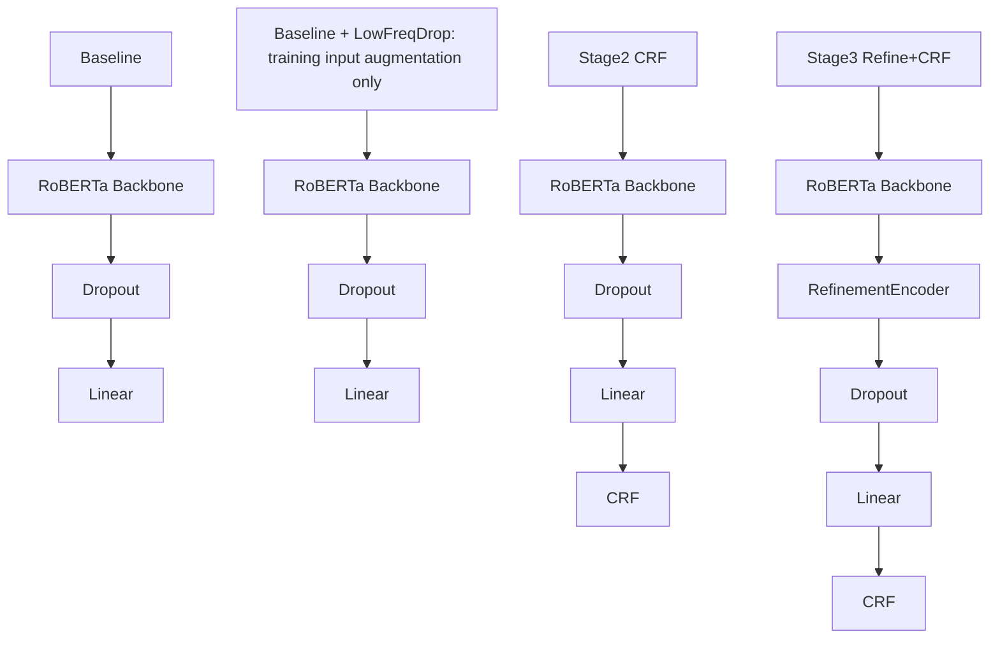

<style>
body,
.report-body {
-webkit-print-color-adjust: exact;
print-color-adjust: exact;
}
.report-title {
color: #1f6d96;
font-size: 2.4em;
margin: 1.2em 0 0.3em 0;
}
.report-h2 {
color: #1f6d96;
margin: 0.35em 0;
}
.report-h3 {
color: #1f6d96;
margin: 0.85em 0 0.45em 0;
padding-top: 0.4em;
border-top: 1px solid #8fd0f0;
}
hr {
border: none;
border-top: 1px solid #8fd0f0;
height: 0;
}
.report-rule-strong,
hr.report-rule-strong {
border: none;
border-top: 3px solid #2d9cdb;
height: 0;
margin: 1em 0;
}
.report-rule,
hr.report-rule {
border: none;
border-top: 2px solid #49afe3;
height: 0;
margin: 0.9em 0;
}
.report-rule-light,
hr.report-rule-light {
border: none;
border-top: 1px solid #8fd0f0;
height: 0;
margin: 0.7em 0 1em 0;
}
.report-body {
font-size: 17px;
color: #24313a;
}
.report-body p {
text-indent: 2em;
line-height: 1.95;
margin: 0.9em 0;
}
.report-body p[align="center"] {
text-indent: 0;
}
.report-body table {
margin: 0.9em auto;
width: auto;
}
.report-body img {
display: block;
margin: 0.8em auto;
max-width: 84%;
height: auto;
}
.mermaid,
.report-body .mermaid {
display: flex;
justify-content: center;
align-items: center;
width: 100%;
text-align: center;
margin: 0.8em auto;
}
.mermaid svg,
.report-body .mermaid svg {
display: block;
margin: 0 auto;
max-width: 100%;
height: auto;
}
code,
.report-body code {
background: #f3f8fc;
border: 1px solid #d7e7f2;
border-radius: 4px;
padding: 0.08em 0.34em;
font-size: 0.92em;
}
pre,
.report-body pre {
display: block;
background: #f7fbfe;
border: 1.2px solid #cfe3f1;
border-left: 4px solid #49afe3;
border-radius: 8px;
padding: 0.95em 1.05em;
margin: 1em 0;
overflow-x: auto;
line-height: 1.6;
box-sizing: border-box;
page-break-inside: avoid;
break-inside: avoid;
}
pre code,
.report-body pre code {
background: transparent;
border: none;
padding: 0;
font-size: 0.93em;
display: block;
}
.report-body li p,
.report-body blockquote p {
text-indent: 0;
}
.report-body h4 {
color: #1f6d96;
margin: 0.9em 0 0.35em 0;
padding-top: 0.25em;
border-top: 1px solid #d9eef9;
}
.report-caption {
text-indent: 0;
text-align: center;
line-height: 1.6;
margin: 0.2em auto 0.9em auto;
font-size: 0.95em;
color: #44515c;
}
</style>

<div class="report-body">
<div align="center">
<h1 class="report-title">基于 Transformer 的中文命名实体识别实验报告</h1>
</div>

<hr class="report-rule-strong" />

<p align="center" style="text-indent: 0;">
<strong>姓名：</strong>蒋一鸣
　　    
<strong>学号：</strong>2023211751
</p>

<p align="center" style="text-indent: 0;">
<strong>课程作业：</strong>基于 Transformer 的中文 NER
　　    
<strong>使用大模型：</strong>ChatGPT 辅助，详见第五章
</p>

<hr class="report-rule" />
<div align="center">
<h2 class="report-h2">摘要</h2>
</div>
<hr class="report-rule-light" />

　　报告围绕中文命名实体识别课程作业展开，完成了从数据审计、字符级标签对齐、模型训练到预测文件导出的整套实验流程。模型主干统一采用中文 `RoBERTa`，并在同一套数据处理与训练口径下比较了 `Baseline`、`Baseline + LowFreqDrop`、`Stage2 CRF` 和 `Stage3 Refine+CRF` 四条实验线。同时还补上了长句滑窗恢复、输出格式自动校验、checkpoint 保存与恢复等工程环节，保证最终提交文件可以直接使用。

　　实验结果表明，在当前数据和超参数设置下，最简单的 `Baseline` 仍然是四条实验线中表现最好的方案：它同时取得了最高的开发集 token-level accuracy 和最高的 best checkpoint 实体级 F1，因此最终提交文件采用 `Baseline` 路线生成的测试集预测结果。下文依次展开数据加工、模型结构、训练过程、结果分析、参考文献与大模型辅助边界。

<hr class="report-rule" />
<div align="center">
<h2 class="report-h2">实验环境</h2>
</div>
<hr class="report-rule-light" />

　　本报告中的正式实验结果来自远程 Linux 服务器上的 Conda 虚拟环境 `nerhw`。目前已经完整跑完的四条实验线各自生成的 [`experiment_summary.csv`](outputs/baseline_roberta_linear_20260408_103539/results/experiment_summary.csv) 都记录了相同的设备名称 `NVIDIA A100-SXM4-80GB`，因此也可以确认主实验是在 A100 80GB GPU 上训练和预测得到的。软件依赖由仓库根目录的 [`requirements.txt`](requirements.txt) 中已经做出说明，Python 主版本范围则以 [`README.md`](README.md) 的运行说明为准，即 `Python 3.10` 或 `3.11`。

注：实验没有进一步锁定服务器环境的 patch 版本，因此表 0-1 只写当前能够直接核实的信息。

　　可核实的实验环境信息如下。

| 项目              | 配置                                      |
| ----------------- | ----------------------------------------- |
| 操作环境          | Linux 服务器                              |
| Python 环境       | Conda 虚拟环境 `nerhw`                  |
| Python 版本       | `3.10` 或 `3.11`                      |
| GPU               | `NVIDIA A100-SXM4-80GB`                 |
| 深度学习框架      | `torch>=2.1.0`                          |
| 预训练模型框架    | `transformers>=4.39.0`                  |
| tokenizer 依赖    | `tokenizers>=0.15.0`                    |
| Hugging Face 依赖 | `huggingface-hub>=0.20.0`               |
| 数值计算          | `numpy>=1.24.0`                         |
| 数据处理          | `pandas>=2.0.0`                         |
| 可视化            | `matplotlib>=3.8.0`                     |
| 评估与工具        | `scikit-learn>=1.3.0`, `tqdm>=4.66.0` |

<p align="center" class="report-caption">表 0-1 实验环境信息</p>

<hr class="report-rule" />
<div align="center">
<h2 class="report-h2">第一章 数据加工</h2>
</div>
<hr class="report-rule-light" />

　　按照 [`data.py`](data.py) 的实际实现，原始文本会先经过 `read_token_lines` 读取，再依次进入 `check_text_tag_alignment`、`build_label_metadata`、`_length_summary`、`build_tokenizer`、`sample_tokenizer_alignment` 和 `run_data_analysis`。其中，`run_data_analysis` 会把统计结果记录在 [`data/label_stats.json`](data/label_stats.json) 和 [`data/data_report.json`](data/data_report.json)，后续的画图脚本和训练入口也是直接复用这两份产物。

　　除特别说明外，报告中的代码块均为项目源码里的核心代码摘录；文中出现的表格、图和统计数据，也都可以在仓库根目录下的源码文件、[`data`](data) 和 [`outputs`](outputs) 目录中找到对应来源。



<div align="center">
<h3 class="report-h3">1.1 标注集</h3>
</div>

　　本作业是一个中文逐字序列标注任务。就任务类型而言，命名实体识别通常被建模为序列标注问题[7]。输入文件 `train.txt` 按行给出字符序列，`train_TAG.txt` 则给出与之逐字对齐的标签序列。本项目采用 `BIO` 风格的标签体系[8]，其中 `B_*` 表示实体开头，`I_*` 表示实体内部，`O`（字母 O）表示非实体位置。根据训练集标签统计结果，当前标注集合一共包含 9 类标签，并且标签顺序与代码中 `label2id` 的构造顺序完全一致。

　　当前数据共使用 9 类标签，实体类型一共 4 类，分别是地点实体 `LOC`、机构实体 `ORG`、人名实体 `PER` 和时间实体 `T`。

| 标签      | 类别     | 含义                       |
| --------- | -------- | -------------------------- |
| `O`     | 非实体   | 当前位置不属于任何命名实体 |
| `B_LOC` | 实体起始 | 地点实体的起始字符         |
| `B_ORG` | 实体起始 | 机构实体的起始字符         |
| `B_PER` | 实体起始 | 人名实体的起始字符         |
| `B_T`   | 实体起始 | 时间实体的起始字符         |
| `I_LOC` | 实体内部 | 地点实体的后续字符         |
| `I_ORG` | 实体内部 | 机构实体的后续字符         |
| `I_PER` | 实体内部 | 人名实体的后续字符         |
| `I_T`   | 实体内部 | 时间实体的后续字符         |

<p align="center" class="report-caption">表 1-1 标注集与标签含义</p>

　　上述标签顺序并不是随意排列的，而是由训练集标签统计函数自动生成后写入 [`data/label_stats.json`](data/label_stats.json)。后续训练、评估、预测与输出恢复都统一依赖这一组标签定义，因此第一步必须先把标注集和索引映射固定下来。

<div align="center">
<h3 class="report-h3">1.2 标签统计方法与索引映射</h3>
</div>

　　标签集合、标签频次以及标签索引映射由 [`data.py`](data.py) 中的 `build_label_metadata` 函数自动统计得到。该函数直接遍历 `train_TAG.txt` 读出的标签序列，并使用 `collections.Counter` 进行频次累计；在得到频次后，代码中显式地将 `O`（字母 O）放在第一个位置，再对其余标签做排序，最后构造 `label2id` 和 `id2label`。作业要求中提到地要说明通过什么函数获得标注集及其频次，在这里 `Counter` 对应的正是最直接、最可复现的实现方式；把标签 `O` 固定在索引 `0`（数字 0）处，也会让日志阅读、错误分析和调试更直观。

　　下面给出 `build_label_metadata` 中与标签统计最相关的核心代码片段。该片段直接对应本报告后续出现的标签集、频次表和映射表。

注：后续报告中出现的代码均可在源代码的文件夹中找到

```python
counter = Counter()
for line in tag_lines:
    counter.update(line)

labels = []
if "O" in counter:
    labels.append("O")
labels.extend(sorted(label for label in counter.keys() if label != "O"))

label2id = {label: index for index, label in enumerate(labels)}
id2label = {index: label for label, index in label2id.items()}
```

　　标签频次直接来自对 `train_TAG.txt` 的逐行扫描，标签顺序也由程序确定，后续复用同一份代码就能得到完全一致的标签定义。

　　根据当前仓库中的 [`data/label_stats.json`](data/label_stats.json)，训练集标签统计结果如下。为了与实际训练配置保持一致，表中标签顺序按 `label2id` 排列，而不是按字典序重新排序。

| 标签      |   出现次数 |
| --------- | ---------: |
| `O`     | 17,182,664 |
| `B_LOC` |    206,640 |
| `B_ORG` |     15,081 |
| `B_PER` |    182,664 |
| `B_T`   |    180,819 |
| `I_LOC` |    326,891 |
| `I_ORG` |     33,203 |
| `I_PER` |    352,243 |
| `I_T`   |    494,698 |

<p align="center" class="report-caption">表 1-2 训练集标签频次统计（按 `label2id` 顺序）</p>

　　由上表可知，训练集中总标注位数为 18,974,903，其中 `O` 标签占了绝大多数位置。后续长度分析和结果分析都会用到这一结果，因为它会直接影响 token-level accuracy 的解释方式。

　　标签到索引的映射如下。

| 标签      | 索引 |
| --------- | ---: |
| `O`     |    0 |
| `B_LOC` |    1 |
| `B_ORG` |    2 |
| `B_PER` |    3 |
| `B_T`   |    4 |
| `I_LOC` |    5 |
| `I_ORG` |    6 |
| `I_PER` |    7 |
| `I_T`   |    8 |

<p align="center" class="report-caption">表 1-3 `label2id` 映射表</p>

　　索引到标签的反向映射如下。训练日志记录、预测恢复、提交文件导出都需要依赖这张表把模型输出的类别编号重新转回标签字符串。

| 索引 | 标签      |
| ---- | --------- |
| 0    | `O`     |
| 1    | `B_LOC` |
| 2    | `B_ORG` |
| 3    | `B_PER` |
| 4    | `B_T`   |
| 5    | `I_LOC` |
| 6    | `I_ORG` |
| 7    | `I_PER` |
| 8    | `I_T`   |

<p align="center" class="report-caption">表 1-4 `id2label` 映射表</p>

　　除标签频次之外，训练集标签序列还额外做了严格 BIO 检查。这里采用的判定规则是：句首不能直接是 `I_*`，`O` 后不能直接接 `I_*`，实体内部也不能出现跨类型的 `I_X -> I_Y` 转移。统计结果表明，230,039 个句子中没有句首 `I_*`，也没有 `O -> I_*`；但在 18,744,864 个相邻标签转移中，存在 18,968 次跨类型 `I_* -> I_*` 转移，约占全部相邻转移的 0.10%。出现次数最多的几类如下。

| 非严格 BIO 转移    | 出现次数 |
| ------------------ | -------: |
| `I_T -> I_LOC`   |    4,519 |
| `I_PER -> I_T`   |    3,882 |
| `I_LOC -> I_T`   |    3,762 |
| `I_LOC -> I_PER` |    2,413 |
| `I_T -> I_PER`   |    1,527 |

<p align="center" class="report-caption">表 1-5 训练集中的主要非严格 BIO 转移</p>

　　训练数据总体上接近 BIO 标注，但并不是严格满足所有 BIO 约束。如果在 CRF 中直接强制启用 `strict_bio`，这些训练集中真实出现的转移会被统一视为非法路径。第二章 `2.6` 中把 `bio_constraint_mode` 设为 `none`，就是基于这一统计事实，并非经验猜测无依据。

<div align="center">
<h3 class="report-h3">1.3 数据规模与长度分布分析</h3>
</div>

　　在送入模型之前，项目首先会对原始文本和标签做最基础的数据健康检查。[`data.py`](data.py) 中的 `check_text_tag_alignment` 函数会同时检查两个条件：一是文本行数与标签行数是否一致，二是每一行的字符数与标签数是否严格一致。运行后生成的 [`data/data_report.json`](data/data_report.json) 表明，训练集和开发集都通过了这两类检查：`line_count_match=true`，`token_count_match=true`。原始文本和标签一旦未对齐，后续所有训练指标都不可信，因此这一步必须先跑通。

　　对应的核心检查逻辑如下所示。这里没有使用复杂的数据结构，而是选择最直接的“逐行比较 + 记录前若干个错误样本”的方式，这样更便于后续的排查。

```python
line_count_match = len(text_lines) == len(tag_lines)
token_count_mismatches = []

for line_index, (text_tokens, tag_tokens) in enumerate(zip(text_lines, tag_lines), start=1):
    if len(text_tokens) != len(tag_tokens):
        token_count_mismatches.append(
            {
                "line_index": line_index,
                "text_token_count": len(text_tokens),
                "tag_token_count": len(tag_tokens),
            }
        )
```

　　只要行数或字符数有一项不一致，监督信号就已经不可靠，必须先停下来修数据。代码没有把全部错误样本都打印出来，而是只保留前若干个错位样本，方便后续在 `data_report.json` 中做 spot check。

　　从数据规模上看，训练集、开发集和测试集的样本数分别为 230,039、29,965 和 26,264。训练集与开发集同时具备文本和标签，因此可以做对齐检查；测试集只有文本，没有标注，因此它只参与长度统计和最终预测，不参与文本-标签一致性校验。

　　项目级长度统计结果保存在 [`outputs/project_summary/results/length_summary.csv`](outputs/project_summary/results/length_summary.csv) 中。当前正式实验统一采用 `max_len=384`，因此本章重点关注平均长度、P95、P99、最大长度，以及超过 `max_len` 的样本数和比例。三份数据的长度分布统计如下。

| split |   count |    mean | p95 | p99 |  max | over_max_len_count | over_max_len_ratio |
| ----- | ------: | ------: | --: | --: | ---: | -----------------: | -----------------: |
| train | 230,039 | 82.4856 | 207 | 307 | 1511 |                835 |           0.003630 |
| dev   |  29,965 | 82.6057 | 208 | 308 |  835 |                121 |           0.004038 |
| test  |  26,264 | 83.4153 | 218 | 329 | 1457 |                128 |           0.004874 |

<p align="center" class="report-caption">表 1-6 train/dev/test 长度分布统计（`max_len=384`）</p>

　　如果把超过长度上限的比例记为：

$$
\text{over\_max\_len\_ratio}=\frac{\text{over\_max\_len\_count}}{\text{count}},
$$

　　三份数据中超过 `max_len=384` 的样本比例分别为 0.36%、0.40% 和 0.49%。大多数样本都能在单次前向中完成编码，但仍然存在少量极长样本，例如训练集最长样本长度达到 1511，测试集最长样本长度达到 1457。正因为这些极长样本的存在，后续预测阶段不能简单直接截断，而必须设计专门的长句处理机制。

　　标签频次还反映出一个更重要的问题：数据存在明显类别不均衡。设全部标签集合为 $\mathcal{Y}$，则 `O` 标签占比可以写成：

$$
O\_ratio=\frac{\text{count}(O)}{\sum\_{y\in\mathcal{Y}}\text{count}(y)}.
$$

　　根据 [`data/label_stats.json`](data/label_stats.json) 中的标签频次，`O` 标签占比约为 90.55%。这与 [`outputs/project_summary/results/data_insights.md`](outputs/project_summary/results/data_insights.md) 中的审计结论一致。如果只看 token-level accuracy，模型很容易因为大量正确预测 `O` 标签而得到很高的分数，因此后续结果分析还需要补充实体级指标。

　　除了标签频次和长度统计之外，`run_data_analysis` 还会把本章涉及的大部分中间结果统一写入 [`data/data_report.json`](data/data_report.json)。这份报告不仅保存了 `train/dev` 的对齐检查结果和三个数据集的长度统计，还保留了 tokenizer 对齐抽样结果 `tokenizer_alignment_samples`，后续画图脚本和说明文档也直接复用这份 JSON。本章里的表格都来自这条数据分析流水线，不是为了写报告临时手工整理的。


<p align="center" class="report-caption">图 1-1 标签频次分布</p>

　　图 1-1 说明 `O` 标签在训练语料中占绝对多数，这也是类别不均衡的直接可视化证据。


<p align="center" class="report-caption">图 1-2 标签频次细化分布</p>

　　图 1-2 可以看出，时间实体 `I_T`、人名实体 `I_PER` 和地点实体 `I_LOC` 的频次相对更高，而机构实体相关标签明显更少。这种差异也会影响不同实体类别上的识别难度。


<p align="center" class="report-caption">图 1-3 train/dev/test 三个数据集的长度分布</p>

　　图 1-3 与表 1-6 的统计结论一致：绝大多数样本不会触发长度上限，但长尾样本确实存在，因此后续预测阶段必须考虑超长输入的恢复问题。

<div align="center">
<h3 class="report-h3">1.4 数据对齐与 Tokenizer 处理</h3>
</div>

　　中文 NER 里有一个容易被忽视的问题：“字符位置”和“token 位置”并不等价。虽然大量中文字符在 tokenizer 之后仍然会落到单个 token 上，但数字、英文片段以及部分符号仍然可能被拆成多个 sub-token。如果直接假设“一字一 token”，标签就会在训练和评估时发生错位，最终导致损失计算、准确率统计和预测恢复全部失真。

　　[`data.py`](data.py) 的 `NERBatchCollator.__call__` 中显式使用 fast tokenizer 的 `word_ids()` 做对齐。要让这一步成立，输入给 tokenizer 的必须不是拼接后的整句字符串，而是“字符列表的列表”，同时编码时还要打开 `is_split_into_words=True`。这样 tokenizer 才能在编码完成后告诉程序：每一个 token 对应原始句子中的第几个字符。生成的 [`data/data_report.json`](data/data_report.json) 中也明确记录了 `tokenizer_is_fast=true`，说明使用的确实是支持 `word_ids()` 的 fast tokenizer。

　　在进入逐 token 对齐之前，`NERBatchCollator` 会先构造模型真正使用的 batch 张量。对应代码如下，分别完成输入编码、`ignore_index` 标签初始化以及 `valid_mask` 初始化。

```python
words_batch = [list(example.chars) for example in batch]
encoded = self.tokenizer(
    words_batch,
    is_split_into_words=True,
    padding=True,
    truncation=True,
    max_length=self.max_len,
    return_attention_mask=True,
    return_tensors="pt",
)

input_shape = encoded["input_ids"].shape
labels = torch.full(input_shape, self.ignore_index, dtype=torch.long)
valid_mask = torch.zeros(input_shape, dtype=torch.bool)
```

　　原始字符在进入 tokenizer 前仍然保持逐字列表形式，没有被提前拼回字符串，因此 `word_ids()` 才能正确映射回字符下标。`labels` 一开始全部被初始化为 `ignore_index=-100`，默认状态下所有 token 都不参与 loss；只有后续被确认是“真实字符首 token”的位置，才会被写入真实标签。`valid_mask` 从一开始就是一张独立的布尔掩码，它和 attention mask 的语义不同，专门标记哪些位置真正对应原始字符。

　　下面给出 `NERBatchCollator.__call__` 中最关键的一段对齐代码。该代码负责构造 `valid_mask`，并把原始字符级标签放到正确的 token 位置上。

```python
for batch_index, example in enumerate(batch):
    word_ids = encoded.word_ids(batch_index=batch_index)
    seen_word_ids = set()
    previous_word_id = None

    for token_index, word_id in enumerate(word_ids):
        if word_id is None:
            continue
        seen_word_ids.add(word_id)
        if word_id != previous_word_id:
            valid_mask[batch_index, token_index] = True
            if example.tags is not None and word_id < len(example.tags):
                labels[batch_index, token_index] = self.label2id[example.tags[word_id]]
        previous_word_id = word_id
```

　　当 `word_id is None` 时，当前位置对应的是 special token 或 padding，因此既不承接标签，也不参与后续损失和指标计算。如果同一个原始字符被拆成多个 sub-token，只有第一个 sub-token 会被打上 `valid_mask=True` 并承接标签，其余 sub-token 会被显式忽略。`valid_mask` 记录的不是“哪些位置有 attention”，而是“哪些位置真正对应原始字符”。

　　除了 `labels` 和 `valid_mask` 之外，这段 collator 代码还会同步记录 `kept_lengths`、`original_lengths` 和 `truncated_flags`。其中，`kept_lengths` 表示截断后真正保留下来的原始字符数，`truncated_flags` 用来标记该样本是否因为 `max_len` 被截断。这些字段不会直接参与第一章的数据统计，但会继续用于第二章中的训练接口、预测恢复和长句处理逻辑。

　　第一章这里只保留一个结论：字符级标签最终只会落到“每个原始字符对应的首个 sub-token”上，其余位置统一忽略，并由 `valid_mask` 记录有效位。

<hr class="report-rule" />
<div align="center">
<h2 class="report-h2">第二章 模型结构与执行细节</h2>
</div>
<hr class="report-rule-light" />

<div align="center">
<h3 class="report-h3">2.1 代码结构总览与实验流程</h3>
</div>

　　本项目把数据读取、模型定义、训练恢复、预测导出和结果汇总拆开处理，第二章中会反复引用的核心文件及其职责如下：

| 文件                  | 主要职责                                                                                |
| --------------------- | --------------------------------------------------------------------------------------- |
| `config.py`         | 统一管理 profile、variant、训练超参数、滑窗参数和实现开关                               |
| `data.py`           | 数据读取、标签统计、tokenizer 对齐、dataset/collator、bucket batching                   |
| `model_backbone.py` | 统一封装 backbone、refinement、classifier、CRF 与损失计算                               |
| `model_refine.py`   | 手写轻量 refinement 编码器，包括 attention、FFN 和残差层                                |
| `crf.py`            | 手写线性链 CRF，包括约束构造、配分函数、gold score 和 Viterbi 解码                      |
| `train.py`          | 训练入口、优化器/调度器、checkpoint 保存、resume 恢复、训练日志落盘                     |
| `evaluate.py`       | token-level accuracy、entity-level micro-F1 及统一解码逻辑                              |
| `predict.py`        | 最佳模型加载、长句滑窗推理、窗口融合、输出文件生成和格式校验                            |
| `plot_curves.py`    | 单实验图表、多路线对比图、项目级汇总表和统计图生成                                      |
| `utils.py`          | 通用工具函数，包括目录管理、设备选择、checkpoint 与输出格式校验                         |
| `main.py`           | 统一 CLI 入口，负责 `analyze/train_baseline/train_final/resume/predict/plot/all` 调度 |

<p align="center" class="report-caption">表 2-1 代码结构与模块职责</p>

　　命令行入口 [`main.py`](main.py) 通过 `--mode` 和 `--variant` 两个核心参数控制整个实验流程。下面的代码片段展示了分析、训练、恢复训练和预测如何挂到同一个入口中。

```python
parser.add_argument(
    "--mode",
    required=True,
    choices=["analyze", "train_baseline", "train_final", "resume", "predict", "plot", "all"],
)

if args.mode == "train_baseline":
    train_baseline(config)
    return
if args.mode == "train_final":
    train_final(config)
    return
if args.mode == "resume":
    ...
if args.mode == "predict":
    run_prediction(config, experiment_dir=args.experiment_dir)
```

　　项目没有把所有逻辑都堆进一个训练脚本，而是把数据分析、不同路线训练、恢复训练和预测分成四类入口。同一套配置体系和目录结构就可以同时服务于 `baseline`、`Baseline + LowFreqDrop`、`Stage2 CRF` 和 `Stage3 Refine+CRF`，不需要为每条实验线再单独维护一份脚本。

　　从数据读取到最终校验的整体流程如下，图中展示出了数据层、模型层和推理层。



<p align="center" class="report-caption">图 2-1 从数据读取到最终校验的整体流程</p>

　　图 2-1 把数据层、模型层和推理层放在同一条链路中：`NERBatchCollator` 已经在数据层固定了 `word_ids()` 对齐和 `valid_mask` 语义，长句滑窗则只出现在预测恢复阶段；`baseline_roberta_linear_lowfreqdrop` 没有单独画成新的模型框，是因为它与 `baseline` 的网络拓扑完全一致，差别只在训练输入增强。

<div align="center">
<h3 class="report-h3">2.2 Backbone：预训练语言模型</h3>
</div>

　　四条已完成实验线共享同一个主干编码器，即 `hfl/chinese-roberta-wwm-ext`，并在加载失败时允许回退到 `bert-base-chinese`。这一加载逻辑由 [`model_backbone.py`](model_backbone.py) 的 `_load_backbone` 完成，最终调用的是 `AutoModel.from_pretrained(...)`。因此，本项目并没有手工重写一个 Transformer 主干，而是在预训练 BERT/RoBERTa 编码器范式之上完成 NER 微调和附加模块设计[2][3]。

　　当前代码中最直接能从运行时对象读取到的 backbone 参数是 `hidden_size`。在 [`model_backbone.py`](model_backbone.py) 中，代码通过 `self.backbone.config.hidden_size` 读取主干输出维度，并把这个值继续传给分类头和 refinement 模块；当前默认 backbone 下该值为 `768`。这也是 [`config.py`](config.py) 中注释“当前默认 backbone 下 hidden_size=768，因此 refine_ffn_dim 默认取 1536”的依据。

　　除 `hidden_size` 之外，其余 backbone 结构参数来自 `hfl/chinese-roberta-wwm-ext` 的公开 `config.json`。按照该模型的公开配置，当前主干属于 BERT-base 规格的中文 RoBERTa，其结构参数如下：

| 参数                        |  数值 |
| --------------------------- | ----: |
| `vocab_size`              | 21128 |
| `hidden_size`             |   768 |
| `num_hidden_layers`       |    12 |
| `num_attention_heads`     |    12 |
| `intermediate_size`       |  3072 |
| `max_position_embeddings` |   512 |

<p align="center" class="report-caption">表 2-2 预训练 backbone 结构参数</p>

　　需要强调的是，表 2-2 描述的是“所加载预训练模型的公开配置”，而不是本项目手工实现的网络层数。真正负责新增结构的代码只有分类头、CRF 和 refinement 模块；backbone 本体仍然是标准预训练中文 RoBERTa。正式实验统一采用 `max_len=384`，因此虽然 backbone 的位置编码上限是 512，但训练和常规预测中只使用其中的前 384 个位置。

　　从表示来源上看，本项目并没有随机初始化字向量后从头训练，而是直接复用 `hfl/chinese-roberta-wwm-ext` 的预训练参数作为编码器初始化。采用这种初始化方式的直接原因是：如果完全从零训练 Transformer 编码器，训练成本和不稳定性都会显著上升；而当前任务的重点，是在预训练 backbone 之上构建可靠的 NER 管线，并比较额外模块的边际收益。

#### 2.2.1 模型选择与实现取舍：为什么没有手写 BERT 主干

　　本次作业直接调用 Hugging Face 提供的预训练中文模型，而没有从零手写 BERT 主干。原因我是这样考虑的：作业重点是完成一个可运行、可比较、可提交的 Transformer NER 系统，而不是重新做语言模型预训练。当前数据集只有实体标注监督信号，更适合做下游 NER 微调；如果再从零训练 BERT，不仅需要额外的大规模无监督语料，也会显著增加训练成本和不稳定性。

　　实现工作因此集中在 NER 管线里更关键、也更容易出错的环节：字符到 token 的严格对齐、`valid_mask` 的统一语义、稀疏有效位到连续 CRF 序列的压缩、手写线性链 CRF、手写 refinement 模块、长句滑窗恢复以及输出格式自动校验。backbone 由 [`model_backbone.py`](model_backbone.py) 统一加载，新增的可控结构主要集中在 `data.py`、`crf.py`、`model_refine.py`、`train.py` 与 `predict.py`。

　　把这层分工再说直白一点：预训练 backbone 负责提供通用的上下文化表示；真正围绕这次作业数据格式去手写、调试和反复修改的，是字符级对齐、任务层、`CRF`、`RefinementEncoder`、训练流程、长句恢复和输出校验这些直接决定中文 `NER` 作业完成质量的部分。

#### 2.2.2 对 BERT / RoBERTa 编码框架的理解

　　虽然 backbone 本身不是手写实现，但本项目在设计 NER 管线时，我对 BERT/RoBERTa 编码框架的工作原理做了深度的学习，这也是后续 `valid_mask` 对齐、`compress_for_crf` 压缩和 `RefinementEncoder` 结构设计都能在 backbone 输出之上稳定运行的前提。本节从自注意力机制、预训练范式差异和中文适配三个维度依次展开。

#### 自注意力机制与双向上下文

　　BERT/RoBERTa 编码框架的核心，是 Transformer Encoder 中的多层双向自注意力[1][2]。与 GPT 系列的 decoder-only 结构不同，BERT 的每一层自注意力对输入序列中的所有位置都不施加因果遮盖（causal mask），这使得每个位置在计算表示时可以同时融合左侧和右侧的上下文。具体来说，自注意力的核心公式为[1]

$$
\text{Attention}(Q,K,V)=\text{softmax}\left(\frac{QK^\top}{\sqrt{d_k}}\right)V,
$$

　　其中查询矩阵 $Q$、键矩阵 $K$ 和值矩阵 $V$ 均来自同一组隐状态的线性投影，$d_k$ 是 head 维度，除以 $\sqrt{d_k}$ 是为了避免内积随维度增大而进入 softmax 的饱和区。当 BERT 取消因果遮盖后，每个 token 的注意力分布可以覆盖序列中任意位置，因此输出的隐状态天然是“全局上下文相关”的表示，而非仅依赖左侧历史的单向表示。

　　这一特性对 NER 任务而言尤为重要[2][7]。命名实体识别要求模型同时利用一个字符的左上下文和右上下文来判断其标签。例如，“苹果”是公司还是水果，往往取决于它后面出现的是“公司”“股票”还是“味道”。decoder-only 结构在推理阶段只能看到左侧历史，无法利用右侧证据，因此在序列标注任务上天然处于不利位置；而 encoder-only 的双向结构则可以让每个字符的表示都整合来自整句话的信息，更适合为序列中每个位置独立给出标签判断。

#### BERT 的预训练范式与 RoBERTa 的稳健优化

　　BERT 的预训练通过两个任务完成：掩码语言模型（Masked Language Modeling, MLM）和下一句预测（Next Sentence Prediction, NSP）[2]。MLM 的做法是随机遮住输入序列中一部分 token，让模型根据两侧上下文恢复被遮盖的内容；NSP 则判断两段文本是否连续。这两个任务共同驱动模型在预训练阶段学习到对下游任务有泛化价值的语言表示。

　　RoBERTa[3] 在 BERT 的同类 encoder 框架上进一步优化了预训练设置：去掉了被发现贡献有限的 NSP 任务，改用动态掩码策略，同时使用更大批次、更长训练时间和更多无监督语料。这些改动并不改变 Transformer Encoder 的网络拓扑，但显著改善了预训练表示的质量，使 RoBERTa 在多个下游任务上优于原始 BERT[3]。本项目选择 `hfl/chinese-roberta-wwm-ext` 作为主干，主要是因为它建立在这类优化思路之上，并且具有较明确的中文预训练背景。

#### 中文 Whole Word Masking 与字符级 tokenization 的关系

　　标准 BERT 的 MLM 以 token 为单位施加遮盖，而在中文场景下，tokenizer 通常以单个汉字为粒度切分输入，因此“遮盖一个 token”等价于“遮盖一个汉字”。这种字符级遮盖存在一个问题：如果某个词由多个字符构成，例如“北京”，遮盖其中一个字符后，模型可以直接从相邻字符恢复答案，而无需真正理解这个词在语义上的完整含义。Whole Word Masking（WWM）[4] 的思路是以完整词为单位施加遮盖，使得同一个词中的所有字符要么全部被遮盖，要么全部保留，从而迫使模型必须依赖更大范围的语境来恢复被遮盖的词，而非仅靠紧邻字符。

　　`hfl/chinese-roberta-wwm-ext` 名称中的 `wwm` 正对应这一预训练思路[4]；但本文只借用 [4] 解释 WWM 思路本身，不声称当前 checkpoint 的全部训练细节都由 [4] 直接给出。WWM 预训练方式和当前 NER 任务的字符级对齐需求之间存在一个间接的正向关系：WWM 驱动预训练模型在字符级表示中编码了更强的词边界语义，而这正是字符级 NER 需要识别实体边界时所依赖的基础。这也是本项目在中文 NER 场景下优先选择 `wwm` 变体，而不是通用中文 BERT 的原因之一。

#### Subword tokenization 的对齐挑战与 `valid_mask` 的必要性

　　尽管 `hfl/chinese-roberta-wwm-ext` 的 tokenizer 主要以单汉字为基本单元，但它仍然可能对部分符号、数字或特殊字符产生 subword 拆分，同时在序列首尾自动插入 `[CLS]` 和 `[SEP]`，在批处理时还会在短序列末尾补充 `[PAD]`。这意味着 backbone 的实际输入 token 序列，并不与原始字符序列一一对应：一个原始字符可能对应多个连续 token，而 `[CLS]`、`[SEP]`、`[PAD]` 则完全没有对应的原始字符标签。

　　在这种情况下，如果直接把 backbone 输出的全部 token 位置都送入分类头和 CRF，就会引入大量“无意义位置”的监督信号干扰训练，并在解码时产生与原始字符序列长度不匹配的标签序列。`NERBatchCollator` 通过 `word_ids()` 显式标记出每个 token 是否对应原始字符的第一个 token，并据此构造 `valid_mask`，将后续的损失计算、指标统计和预测恢复统一约束在“真实字符首 token”这一子集上。BERT/RoBERTa 编码框架输出的是完整 token 序列的上下文表示，`valid_mask` 则把其中真正有监督意义的部分筛选出来，再交给后续任务层使用。



<p align="center" class="report-caption">图 2-2 tokenizer 对齐、`word_ids` 与 `valid_mask` 的示意图</p>

#### backbone 输出的使用方式

　　综合以上几点，backbone 负责把原始字符序列编码成每个 token 位置的全局上下文化隐状态 `last_hidden_state`；`valid_mask` 负责把这组隐状态中对应真实字符首 token 的位置筛选出来；后续的线性分类头、CRF 和 `RefinementEncoder` 再在这个经过筛选的子序列上完成任务相关的建模。即使 backbone 回退到 `bert-base-chinese`，整体管线依然成立：两者都提供了兼容的 encoder 输出格式，差异更多体现在预训练质量和中文适配程度上，而不是任务接口本身。

　　对应代码如下：

```python
backbone_outputs = self.backbone(
    input_ids=input_ids,
    attention_mask=attention_mask,
    token_type_ids=token_type_ids,
)
hidden_states = backbone_outputs.last_hidden_state

if self.use_refinement and self.refinement is not None:
    hidden_states = self.refinement(
        hidden_states=hidden_states,
        attention_mask=attention_mask,
    )

hidden_states = self.dropout(hidden_states)
emissions = self.classifier(hidden_states)
```

　　代码里的分工是清楚的：backbone 先输出完整 token 序列的上下文表示 `hidden_states`，refinement 在 token 序列层面做进一步调整，dropout 和分类头再把它映射成标签发射分数，而 `valid_mask` 的筛选被推迟到损失计算和解码阶段。这样 backbone 内部的注意力机制始终能看到完整的 token 上下文，而不是被提前截断的字符子序列。

<div align="center">
<h3 class="report-h3">2.3 四条实验线与三种结构设计</h3>
</div>

　　在模型结构上，本项目使用一个统一的 `RobertaLinearNER` 模型壳，再根据配置决定是否挂接 refinement 和 CRF。从“模型结构”看，只有 3 种主结构；从“已完成实验线”看，则共有 4 条可对比的实验线。二者关系如下。

| 实验线                                  | 结构                                                         | 额外训练增强   |
| --------------------------------------- | ------------------------------------------------------------ | -------------- |
| `baseline`                            | `RoBERTa -> Dropout -> Linear`                             | 无             |
| `baseline_roberta_linear_lowfreqdrop` | `RoBERTa -> Dropout -> Linear`                             | 低频字 dropout |
| `final_stage2`                        | `RoBERTa -> Dropout -> Linear -> CRF`                      | 无             |
| `final_stage3`                        | `RoBERTa -> RefinementEncoder -> Dropout -> Linear -> CRF` | 无             |

<p align="center" class="report-caption">表 2-3 四条实验线与对应结构</p>



<p align="center" class="report-caption">图 2-3 四条实验线的结构对比流程图</p>

　　这 4 条实验线的设计逻辑仍然是尽量一次只改变一个因素。`baseline` 给出最直接的预训练编码器 + 线性分类头结果；`baseline_roberta_linear_lowfreqdrop` 保持完全相同的网络结构，只在训练输入侧加入低频字 dropout，用来做一个最小对照；`Stage2 CRF` 在不引入额外表征层的前提下，只增加 CRF 来观察显式标签转移建模是否有效；`Stage3 Refine+CRF` 再在此基础上加入轻量 refinement，以观察对 backbone 隐状态做进一步自注意力调整之后，是否还能带来额外收益。这样设计的好处是每一条实验线的变化来源都相对清楚，后续结果分析也更容易解释。

　　下面这段来自 [`model_backbone.py`](model_backbone.py) 的代码片段展示了统一模型壳如何按配置条件组装 3 种主结构。

```python
self.refinement: Optional[RefinementEncoder] = None
if self.use_refinement:
    self.refinement = RefinementEncoder(
        hidden_size=hidden_size,
        num_layers=refine_num_layers,
        num_heads=refine_num_heads,
        ffn_dim=refine_ffn_dim,
        dropout=refine_dropout,
    )

self.dropout = nn.Dropout(dropout)
self.classifier = nn.Linear(hidden_size, num_labels)
```

　　模型还会根据 `use_crf` 决定是否构造 `LinearChainCRF`。`baseline`、`baseline_roberta_linear_lowfreqdrop`、`stage2` 和 `stage3` 共享同一套 backbone 加载逻辑、同一套输入表示和同一套解码接口，只是在 `refinement` 和 `crf` 两个位置上发生变化。这样更容易保证实验对比口径一致。

<div align="center">
<h3 class="report-h3">2.4 损失函数设计</h3>
</div>

　　四条实验线共享同一套输入表示和大部分前向流程，但损失函数只分成两种口径。`baseline` 与 `baseline_roberta_linear_lowfreqdrop` 使用 masked cross-entropy，而带 CRF 的路线使用负对数似然。两种损失的差别不只是公式，更关键的是它们对 `valid_mask` 的依赖方式不同。

　　对 `baseline` 和 `baseline_roberta_linear_lowfreqdrop` 而言，模型最终输出的是每个 token 位置的标签分布。由于数据层已经把 special token、padding 和非首个 sub-token 的标签写成 `ignore_index=-100`，因此 [`model_backbone.py`](model_backbone.py) 在前向时只需要筛出 `labels != ignore_index` 的位置，就等价于“只在真实字符位置上计算交叉熵”。对应的损失可以写为

$$
\mathcal{L}_{CE} = - \frac{1}{|\Omega|}\sum_{i \in \Omega} \log p(y_i \mid x),
$$

　　其中 $\Omega$ 表示真实字符对应的位置集合。当前实现中，这个集合不是直接在模型层重新构造，而是由数据层通过 `ignore_index` 间接编码出来。

```python
valid_positions = labels.ne(self.ignore_index)
if valid_positions.any():
    loss = F.cross_entropy(
        emissions[valid_positions],
        labels[valid_positions],
    )
else:
    loss = emissions.sum() * 0.0
```

　　虽然 `baseline` 系列前向里没有显式使用 `valid_mask` 来筛选交叉熵位置，但由于 collator 已经保证只有真实字符首 token 才会写入标签，`labels.ne(ignore_index)` 实际上就等价于“只对 `valid_mask` 对应的真实字位置计算损失”。`baseline_roberta_linear_lowfreqdrop` 与原始 `baseline` 的差异不在损失函数，而在训练输入侧的数据增强。

　　对 `stage2` 和 `stage3` 而言，线性链 CRF 需要一条前缀连续的标签序列，而原始 token 序列中由于 special token 和 sub-token 的存在，会出现“有效位中间有空洞”的情况。因此，模型不会把原始 token 级发射分数直接送入 CRF，而是先通过 `compress_for_crf` 把真实字符位置压缩成连续序列，再把压缩后的发射分数、标签和 `crf_mask` 送入 CRF 计算负对数似然：

$$
\mathcal{L}_{CRF} = \log Z(x) - s(x, y).
$$

　　这里，$\log Z(x)$ 是所有可能标签路径的配分函数，$s(x, y)$ 是真实标签路径分数。它们都建立在“压缩后的真实字符序列”之上，而不是原始 token 序列之上。

```python
compressed_emissions, compressed_labels, crf_mask = self.compress_for_crf(
    emissions=emissions,
    labels=labels,
    valid_mask=valid_mask,
)
outputs["loss"] = self.crf.neg_log_likelihood(
    emissions=compressed_emissions,
    tags=compressed_labels,
    mask=crf_mask,
    reduction="mean",
)
```

　　损失函数设计和结构设计在这里是连在一起的：如果没有第一章中 `valid_mask` 的字符级语义，CRF 就无法得到一条连续、可解释的标签序列；如果没有 `compress_for_crf`，CRF 的 mask 会直接受到 token 对齐空洞的影响。这是数据处理和模型训练之间的一个关键接口。

<div align="center">
<h3 class="report-h3">2.5 手写数据模块与训练接口</h3>
</div>

　　本项目并不是把 tokenizer 的原始输出直接丢给模型，而是通过 `build_examples`、`NERDataset`、`NERBatchCollator` 和 `build_train_dataloader` 主动定义了一套“字符级监督如何进入模型”的接口。这个接口不仅决定了训练时 loss 该算在哪些位置，也决定了评估和预测时标签应该如何恢复到原句级别。

#### 2.5.1 样本构造、`sample_id` 与统一数据入口

　　`data.py` 并不是简单把原始文本读进内存就结束了，而是先通过 `build_examples` 把每一行样本封装成 `NERExample`，并显式保留 `sample_id`。这样做的目的，是让后续预测恢复、滑窗统计、输出校验乃至错误分析都能稳定回溯到原始行号，而不需要重新猜测“当前 batch 里的第几个样本对应原文件中的哪一行”。对应代码如下。

```python
examples: List[NERExample] = []
for index, chars in enumerate(text_lines):
    tags = None if tag_lines is None else list(tag_lines[index])
    examples.append(NERExample(sample_id=index, chars=list(chars), tags=tags))
return examples
```

　　在这个基础上，`prepare_datasets_and_tokenizer` 会进一步统一返回 `train/dev/test` 三套 dataset、标签映射、tokenizer、训练集字频统计以及运行时长度统计。训练脚本不需要重复做“读数据 -> 封装样本 -> 构造 dataset -> 再取标签映射”这一串动作，而是直接从数据模块拿到一整套已经整理好的输入对象。`train.py`、`predict.py` 和后续图表脚本也可以共享同一份数据来源，不会出现各自读文件、各自重新解释标签的情况。

#### 2.5.2 `NERBatchCollator`：字符级监督进入 token 级 batch

　　从模型接口的角度看，`NERBatchCollator` 产出的不只是最常见的 `input_ids` 和 `attention_mask`，还包括 `labels`、`valid_mask`、`sample_ids`、`original_lengths`、`kept_lengths` 和 `truncated_flags` 等序列标注任务直接需要的字段。数据模块不仅负责“把输入编码成 tensor”，还提前把训练、评估、长句恢复所需的字符级语义一起打包好了。对应代码如下。

```python
batch_dict: Dict[str, Any] = {
    "input_ids": encoded["input_ids"],
    "attention_mask": encoded["attention_mask"],
    "labels": labels,
    "valid_mask": valid_mask,
    "chars": words_batch,
    "tags": [example.tags for example in batch],
    "sample_ids": [example.sample_id for example in batch],
    "original_lengths": original_lengths,
    "kept_lengths": kept_lengths,
    "truncated_flags": truncated_flags,
}
```

　　这种统一接口的好处是，后续 [`model_backbone.py`](model_backbone.py)、[`evaluate.py`](evaluate.py) 和 [`predict.py`](predict.py) 都不需要重新定义一套“字符级有效位置”的解释规则，而是可以共享这份由数据模块统一提供的 batch 语义。例如，`model_backbone.py` 会利用 `labels` 和 `valid_mask` 构造 masked cross-entropy 或 `compress_for_crf`；`evaluate.py` 会只在有效字符位置统计指标；`predict.py` 则会利用 `sample_id`、`kept_lengths` 和 `truncated_flags` 判断哪些样本需要进入长句恢复逻辑，并在发生覆盖缺口时把问题精确定位回原始样本。

#### 2.5.3 `kept_lengths`、`truncated_flags` 与预测恢复接口

　　预测阶段，[`predict.py`](predict.py) 会先根据 `original_length`、`kept_length` 和 `truncated` 判断当前样本是否被截断，再决定是直接恢复当前窗口预测，还是进入 `predict_long_sequence` 做长句滑窗推理。对应逻辑如下。

```python
original_length = int(batch["original_lengths"][batch_index])
kept_length = int(batch["kept_lengths"][batch_index])
sample_id = int(batch["sample_ids"][batch_index])
truncated = bool(batch["truncated_flags"][batch_index])

if truncated and config.use_sliding_window:
    long_predictions, long_meta = predict_long_sequence(...)
```

　　`data.py` 里记录的长度字段直接参与预测恢复路径的选择。`kept_length < original_length` 表示该样本在常规编码阶段发生了截断；`truncated_flags` 把这个事实显式暴露给预测逻辑；`sample_id` 让预测阶段在记录 `uncovered_positions` 时能够准确回指到原始数据中的具体样本。数据模块不仅决定了训练监督如何进入模型，也决定了预测阶段如何正确恢复到原句长度。

#### 2.5.4 训练集、开发集接口分离与数据侧增强

　　`data.py` 里另一个设计的点是它把训练增强也约束在了数据接口层，而没有把增强逻辑混进模型前向。当前 `Baseline + LowFreqDrop` 对照实验的低频字 dropout 正是通过 `NERBatchCollator._apply_low_freq_char_dropout` 实现的；与此同时，[`train.py`](train.py) 又显式把训练集和开发集使用的 collator 分开，避免增强污染验证结果。对应代码如下：

```python
train_collator = NERBatchCollator(
    tokenizer=tokenizer,
    label2id=label2id,
    max_len=config.max_len,
    ignore_index=config.ignore_index,
    enable_low_freq_char_dropout=config.use_low_freq_char_dropout,
    low_freq_chars=low_freq_chars,
    low_freq_char_dropout_prob=config.low_freq_char_dropout_prob,
)
dev_collator = NERBatchCollator(
    tokenizer=tokenizer,
    label2id=label2id,
    max_len=config.max_len,
    ignore_index=config.ignore_index,
)
```

　　说明：本项目把“输入如何增强”和“模型如何前向”明确分开处理：训练增强只作用于训练 batch，而验证和预测始终保持原始输入分布。训练集 DataLoader 还会通过 `build_train_dataloader` 选择是否启用 `BucketBatchSampler`；评估与预测阶段则保持稳定顺序，不复用这套按长度分桶的 batch 组织方式。数据侧增强、长度分桶和字符级对齐都放在数据模块这一层统一管理，模型前向只负责消费已经语义明确的 batch 字典。

<div align="center">
<h3 class="report-h3">2.6 手写 CRF 模块</h3>
</div>

　　本项目中的 CRF 并不是直接调用高层封装库，而是由 [`crf.py`](crf.py) 手写实现的线性链 CRF[5]。其基本思想是：在 token 级发射分数之外，再显式学习标签起始分数、标签间转移分数和标签结束分数，从而对相邻标签之间的依赖关系进行建模。若把一条标签路径记为 $y=(y_1,\dots,y_T)$，则其路径分数可以写为

$$
s(x,y)=a_{\text{start}}(y_1)+\sum_{t=1}^{T} e_t(y_t)+\sum_{t=2}^{T} a(y_{t-1},y_t)+a_{\text{end}}(y_T),
$$

　　其中 $e_t(y_t)$ 表示发射分数，$a(\cdot,\cdot)$ 表示标签转移分数。

　　对应到代码，CRF 的核心可学习参数就是三组张量：`start_transitions`、`transitions` 和 `end_transitions`。这可以从 [`crf.py`](crf.py) 的初始化直接看出来。

```python
self.start_transitions = nn.Parameter(torch.empty(num_tags))
self.end_transitions = nn.Parameter(torch.empty(num_tags))
self.transitions = nn.Parameter(torch.empty(num_tags, num_tags))

self.reset_parameters()
```

　　在训练阶段，CRF 需要同时计算所有合法路径的配分函数和真实路径分数。配分函数由 `_compute_log_partition` 完成，其核心在于对“上一时刻路径分数 + 当前转移分数 + 当前发射分数”做 `logsumexp`，从而在保持数值稳定的同时累加所有可能路径。

```python
next_score = (
    score.unsqueeze(2)
    + transitions.unsqueeze(0)
    + emissions[:, time_step].unsqueeze(1)
)
next_score = torch.logsumexp(next_score, dim=1)
score = torch.where(mask[:, time_step].unsqueeze(1), next_score, score)
```

　　真实路径分数则由 `_compute_gold_score` 计算，它会沿着 gold 标签序列依次累加起始、转移、发射和结束分数。最后 `neg_log_likelihood` 返回 `log_partition - gold_score`，也就是第二节中提到的 CRF 负对数似然。

　　在预测阶段，模型使用 `_viterbi_decode_single` 做最优路径解码。它先用动态规划记录“当前目标标签的最优前驱标签”，再通过回溯得到整条最优标签路径。对应代码如下。

```python
candidate_score = score.unsqueeze(1) + transitions
best_score, best_path = candidate_score.max(dim=0)
score = best_score + emissions[time_step]
history.append(best_path)
```

　　除了标准线性链 CRF 本身，当前实现还额外提供了 `bio_constraint_mode = none / strict_bio / auto` 三种接口模式。`strict_bio` 会利用 `_is_valid_bio_start` 和 `_is_valid_bio_transition` 对非法 `I_*` 起始和非法跨类型 `I_*` 转移加上极低分数；`none` 则完全不加约束；`auto` 当前保留接口，但在实现上退化为 `none`。在当前 4 条实验线中，统一使用的都是 `none`。并不是模糊的判断，而是第一章已经统计出的标签转移事实：训练集虽然没有句首 `I_*` 和 `O -> I_*`，但存在 18,968 次跨类型 `I_* -> I_*` 转移，其中 `I_T -> I_LOC`、`I_PER -> I_T` 和 `I_LOC -> I_T` 最多。若直接启用 `strict_bio`，这些训练集中真实出现的路径都会被硬性压低分数，因此正式主线保留 `bio_constraint_mode="none"` 更符合当前数据本身的标注情况。

　　最后需要再次强调的是，CRF 接收的 `mask` 不能是原始 token 级的 `valid_mask`，而必须是压缩后的连续 `crf_mask`。[`crf.py`](crf.py) 顶部注释已经明确指出：如果原始位置存在空洞，应先在模型层做压缩后再传入 CRF。这里通过 [`model_backbone.py`](model_backbone.py) 中的 `compress_for_crf` 完成这一步，这也是手写 CRF 模块能够稳定工作的前提。

<div align="center">
<h3 class="report-h3">2.7 手写 Refinement Encoder</h3>
</div>

　　`final_stage3` 相比前两条路线多出的一层结构，是 [`model_refine.py`](model_refine.py) 中手写的轻量 `RefinementEncoder`。它的目的不是替代 backbone，而是在 backbone 已经输出上下文表示之后，再做一次较轻量的自注意力重整和前馈变换，从而微调隐藏表示。这里采用的仍然是 Transformer 系列中经典的缩放点积注意力思想[1]，其核心公式为

$$
\text{Attention}(Q,K,V)=\text{softmax}\left(\frac{QK^\top}{\sqrt{d_k}}\right)V.
$$

　　当前实现将这一公式拆成了多个可独立解释的模块。最底层是 `ScaledDotProductAttention`，负责计算注意力分数、应用 mask、做 softmax，并输出加权后的上下文向量。实现上，attention mask 会统一广播到 key 维度，保证“哪些 token 可见”的语义与 backbone 的 `attention_mask` 保持一致；在 softmax 之前，代码还会先减去每行最大值，再对被 mask 的位置显式清零并重新归一化，以降低长序列训练中的数值不稳定风险。

```python
attention_scores = torch.matmul(query, key.transpose(-1, -2)) / math.sqrt(head_dim)
if attention_mask is not None:
    if attention_mask.dim() == 2:
        attention_mask = attention_mask[:, None, None, :]
    elif attention_mask.dim() == 3:
        attention_mask = attention_mask[:, None, :, :]
    attention_mask = attention_mask.bool()
    attention_scores = attention_scores.masked_fill(~attention_mask, -10000.0)

attention_scores = attention_scores - attention_scores.max(dim=-1, keepdim=True).values
if attention_mask is not None:
    attention_scores = attention_scores.masked_fill(~attention_mask, -10000.0)

attention_probs = torch.softmax(attention_scores, dim=-1)
if attention_mask is not None:
    attention_probs = attention_probs.masked_fill(~attention_mask, 0.0)
    normalizer = attention_probs.sum(dim=-1, keepdim=True).clamp_min(1e-12)
    attention_probs = attention_probs / normalizer
attention_probs = self.dropout(attention_probs)
return torch.matmul(attention_probs, value)
```

　　在 `ScaledDotProductAttention` 之上，`MultiHeadSelfAttention` 负责完成多头拆分、线性投影、多头输出拼接和最终输出映射；`PositionwiseFFN` 则实现了逐位置前馈网络。二者共同组成一层 `RefinementEncoderLayer`。这里采用的是 Pre-LN 结构：先做 LayerNorm，再做自注意力或前馈，再通过残差连接把输出加回原输入。下面的代码可以直接对应这一写法。

```python
attention_output = self.self_attention(
    hidden_states=self.attention_norm(hidden_states),
    attention_mask=attention_mask,
)
hidden_states = hidden_states + attention_output

ffn_output = self.ffn(self.ffn_norm(hidden_states))
hidden_states = hidden_states + ffn_output

if attention_mask is not None:
    hidden_states = hidden_states * attention_mask.unsqueeze(-1).type_as(hidden_states)
return hidden_states
```

　　正式实验中，`RefinementEncoder` 的配置是 `num_layers=1`、`num_heads=4`、`ffn_dim=1536`、`dropout=0.1`。这套配置比 backbone 自身的 12 层结构更轻量，原因也和代码注释保持一致：refinement 的目标是对预训练表示做“表征增强”，而不是重新训练一个更深的 Transformer。过重的新增层不仅会显著增加参数量，还可能扰动已有的预训练表示，导致训练不稳定。`stage3` 进一步把 refinement 的学习率降到 `1e-4`，也是为了配合这种轻量设计，尽可能减少对 backbone 表示空间的扰动。

<div align="center">
<h3 class="report-h3">2.8 训练设置、运行模式与模型选择机制</h3>
</div>

#### 2.8.1 正式实验公共超参数

　　正式实验统一使用 [`train.py`](train.py) 中定义的训练流程。优化器选择 `AdamW`[9]，调度器使用 `warmup_ratio=0.1 + linear decay`，并配合 `weight_decay=0.01`、`grad_clip_norm=1.0`、`batch_size=16`、`grad_accum_steps=1`、`dropout=0.1`、`early_stopping_patience=2` 和 `seed=42`。其中，这里的 `dropout=0.1` 对应的是经典 dropout 正则化语义[6]；学习率调度则采用 warmup 后线性衰减的写法，这一训练实践与 BERT 中使用的 warmup + linear decay 调度是一致的[2]，这里只是在 `LambdaLR` 中按总训练步数重新实现。

　　为了让模型结构与训练配置一眼可查，先把本次正式实验的关键设置汇总如下。

| 项目                    | 当前设置                                                                |
| ----------------------- | ----------------------------------------------------------------------- |
| backbone                | `hfl/chinese-roberta-wwm-ext`，加载失败时回退到 `bert-base-chinese` |
| tokenizer               | 与 backbone 对应的 fast tokenizer，依赖 `word_ids()` 做字符级对齐     |
| 模型类型                | `encoder-only Transformer`，BERT-base 规格                            |
| backbone 结构           | `12 layers / 12 heads / hidden_size=768 / intermediate_size=3072`     |
| 初始参数来源            | 直接加载预训练 checkpoint，不从零随机初始化                             |
| 输入粒度                | 原始输入按字和符号组织，再映射到 token 序列                             |
| 最大输入 token 数       | `384`                                                                 |
| 标签数                  | `9`                                                                   |
| 基础结构                | `RoBERTa -> Dropout -> Linear`                                        |
| 可选附加结构            | `CRF`，`RefinementEncoder(num_layers=1, num_heads=4, ffn_dim=1536)` |
| 优化器与调度            | `AdamW + warmup_ratio=0.1 + linear decay`                             |
| batch size / grad accum | `16 / 1`                                                              |
| 训练轮数                | `Baseline=6`，`LowFreqDrop=5`，`Stage2=6`，`Stage3=5`           |
| best checkpoint 选择    | 按开发集 `dev_accuracy` 最优刷新 `best_model.pt`                    |

<p align="center" class="report-caption">表 2-4 模型与训练配置总览</p>

　　当前正式实验的公共超参数如下。

| 超参数                      | 取值 |
| --------------------------- | ---: |
| `max_len`                 |  384 |
| `batch_size`              |   16 |
| `grad_accum_steps`        |    1 |
| `weight_decay`            | 0.01 |
| `warmup_ratio`            |  0.1 |
| `grad_clip_norm`          |  1.0 |
| `dropout`                 |  0.1 |
| `early_stopping_patience` |    2 |
| `seed`                    |   42 |

<p align="center" class="report-caption">表 2-5 正式实验公共超参数</p>

　　表 2-4 和表 2-5 列出的这些公共项，已经与当前 [`config.py`](config.py) 中 `cloud_train` profile 的设置逐项核对过；因此像 `max_len=384`、`batch_size=16`、`weight_decay=0.01`、`warmup_ratio=0.1`、`grad_clip_norm=1.0` 和 `early_stopping_patience=2` 这些值，和现有代码保持一致。除了这些直接影响优化过程的超参数之外，这里还有一组训练运行时配置：标签忽略值固定为 `ignore_index=-100`，这样 special token、padding 和非首个 sub-token 都不会进入 loss；数据读取的 `num_workers=0`，用于兼容本地调试和服务器环境；训练时默认打开 `use_bucket_batching=true`，并将 `bucket_size_multiplier` 设为 `50`，从而减少 padding 浪费；所有正式实验都固定 `bio_constraint_mode="none"`、`use_sliding_window=true`、`sliding_window_size=384`、`sliding_overlap=64` 和 `sliding_merge_strategy="center_priority"`，以保证训练与预测阶段使用统一的数据恢复口径。

#### 2.8.2 四条实验线的差异配置

　　四条实验线在训练轮数、分组学习率和训练增强开关上存在差异。这里我又对照了四个正式实验目录下保存的 `config.json`、[`train.py`](train.py) 中构造优化器的实际逻辑，以及各目录里写出的 `experiment_summary.csv`。其中训练轮数以每次正式实验实际保存下来的 `config.json` 为准，所以 `Baseline` 和 `Stage2 CRF` 是 6 轮，`Baseline + LowFreqDrop` 和 `Stage3 Refine+CRF` 是 5 轮；而对未启用的模块，`config.json` 虽然仍保留了对应学习率字段，但 `train.py` 不会把它们加入优化器参数组，汇总结果时也会按 `0` 记录其实际生效值。

| 实验线                                  | `num_epochs` | `lr_backbone` | `lr_refinement`（配置 / 生效） | `lr_classifier` | `lr_crf`（配置 / 生效） | 额外增强                                                          |
| --------------------------------------- | -------------: | --------------: | -------------------------------: | ----------------: | ------------------------: | ----------------------------------------------------------------- |
| `baseline`                            |              6 |            2e-5 |                     `1e-3 / 0` |              1e-3 |              `1e-3 / 0` | 无                                                                |
| `baseline_roberta_linear_lowfreqdrop` |              5 |            2e-5 |                     `1e-3 / 0` |              1e-3 |              `1e-3 / 0` | `use_low_freq_char_dropout=true`，`threshold=1`，`prob=0.5` |
| `final_stage2`                        |              6 |            2e-5 |                     `1e-3 / 0` |              1e-3 |           `1e-3 / 1e-3` | 无                                                                |
| `final_stage3`                        |              5 |            2e-5 |                  `1e-4 / 1e-4` |              2e-4 |           `2e-4 / 2e-4` | 无                                                                |

<p align="center" class="report-caption">表 2-6 四条实验线的训练轮数、学习率与增强设置</p>

　　表 2-6 中每个“配置 / 生效”的写法，前者对应实验目录里保存下来的 `config.json`，后者对应 [`train.py`](train.py) 实际加入优化器并写入 `experiment_summary.csv` 的有效学习率。像 `baseline` 这类未启用 `refinement` 或 `CRF` 的实验线，`config.json` 里仍会保留 `lr_refinement`、`lr_crf` 这两个统一配置字段，但真正决定它们是否参与训练的，是同一个配置对象中的 `use_refinement`、`use_crf` 开关，以及 `create_optimizer` 是否把对应模块加入参数组。表中的数值和现有代码、实验配置文件以及训练结果摘要都是一一对上的。

#### 2.8.3 参数分组、学习率调度与输入增强

　　这里的学习率并不是给整个模型统一设置一个值，而是通过参数组分层管理。[`train.py`](train.py) 中的 `_add_param_group` 会显式拆分 `decay` 和 `no_decay` 两类参数，对 `bias`、`LayerNorm.weight` 和 `LayerNorm.bias` 不施加 weight decay。随后 `create_optimizer` 再分别为 backbone、classifier、refinement 和 CRF 组装不同学习率的参数组。

```python
no_decay = ("bias", "LayerNorm.weight", "LayerNorm.bias")
...
grouped_parameters.append(
    {
        "params": no_decay_parameters,
        "lr": learning_rate,
        "weight_decay": 0.0,
        "group_name": f"{name_prefix}_no_decay",
    }
)
```

　　这种参数分组的直接收益是：预训练 backbone 可以用较小学习率稳定微调，而新增的 classifier、CRF 和 refinement 则可以使用更大的学习率更快适应任务。特别是在 `stage3` 中，新增 refinement 和 CRF 的学习率都被显式调低到 `1e-4` 和 `2e-4` 量级，以降低训练不稳定风险。另一方面，`baseline_roberta_linear_lowfreqdrop` 虽然和 `baseline` 共享同一结构与损失函数，但它在训练阶段额外启用了低频字 dropout，因此它的差异应被解释为“输入增强策略”，而不是“模型结构变化”。

　　调度器方面，当前实现会先做 warmup，再对剩余训练步数进行线性衰减。其核心逻辑如下：

```python
if current_step < warmup_steps:
    return float(current_step) / float(max(1, warmup_steps))
remaining_steps = total_training_steps - current_step
decay_steps = total_training_steps - warmup_steps
return max(0.0, float(remaining_steps) / float(max(1, decay_steps)))
```

　　低频字 dropout 的实现位置并不在模型前向内部，而是在 [`data.py`](data.py) 的 `NERBatchCollator` 中。当前逻辑会先根据训练集字频统计出所有满足 `count <= low_freq_char_threshold` 的字符集合，再只在训练 batch 中按概率把这些字符替换为 tokenizer 的 `UNK`。因此，这条实验线改变的是训练输入分布，而不是网络拓扑；它也不应被直接写成经典 dropout[6] 在输入字符上的原样结论。其核心代码如下：

```python
if (
    char in self.low_freq_chars
    and random.random() < self.low_freq_char_dropout_prob
):
    augmented_words.append(self.unk_token)
else:
    augmented_words.append(char)
```

　　与在模型内部额外加层相比，这种做法的优点是改动面更小：标签对齐逻辑、损失函数接口、预测恢复逻辑和输出格式校验都不需要重写，只需把增强限制在训练输入侧即可。也正因为如此，`baseline_roberta_linear_lowfreqdrop` 更适合作为最小对照实验，而不是单独再定义一套模型结构。

#### 2.8.4 本地联调、smoke test 与云端正式实验

　　训练通过 `profile` 显式区分“本地联调”和“云端正式实验”两条工作流。[`config.py`](config.py) 中定义了 `local_debug` 和 `cloud_train` 两套 profile，二者共享同一份模型与训练代码，但在数据量、长度上限、batch 大小和设备优先级上有所区分。具体来说，`local_debug` 采用 `max_len=128`、`batch_size=4`、`num_epochs=1`、`early_stopping_patience=1`、`bucket_size_multiplier=20`、`debug_subset_size=128`；`cloud_train` 则采用 `max_len=384`、`batch_size=16`、更完整的训练轮数和正式实验口径。

　　这种双 profile 设计把“功能是否跑通”和“正式实验是否充分训练”拆开处理。本地联调时，代码会在 [`data.py`](data.py) 的 `prepare_datasets_and_tokenizer` 中只截取前 `debug_subset_size` 条 train/dev/test 数据；预测阶段，[`predict.py`](predict.py) 也会在 `local_debug` 模式下只对这部分开发集和测试集子集做推理。因此，虽然这里没有单独命名为 `smoke_test.py` 的脚本，但 `local_debug` 实际上承担的就是轻量 smoke test 和端到端联调验证的角色：先在小数据上确认数据读取、对齐、前向、评估、预测和输出格式都能正常走通，再切到 `cloud_train` 跑完整实验。

　　设备选择同样依赖 profile。[`utils.py`](utils.py) 中的 `choose_device` 会对 `cloud_train` 采用 `cuda > mps > cpu` 的优先级，而对 `local_debug` 采用 `mps > cuda > cpu` 的优先级。默认假设是“本地调试优先使用 Mac 上的 MPS 或可用的轻量设备，正式实验优先使用服务器 GPU”。这与实际使用方式是一致的：日常改代码、做联调和 smoke test 在本地完成，正式训练、完整预测和最终结果导出在服务器的 A100 80GB 环境下完成。

#### 2.8.5 逐轮训练、日志记录与 best checkpoint 选择

　　真正进入训练循环之后，每个 epoch 的流程都是固定的。先调用 `train_one_epoch` 完成一个 epoch 的训练，再立即在开发集上调用统一评估入口计算开发集指标，随后根据 `dev_accuracy` 判断是否刷新 `best_model.pt`。如果若干轮未提升达到 `early_stopping_patience`，训练就提前停止。这不是“只看最后一轮”，而是标准的“逐 epoch 评估 + best checkpoint 选择”流程。第三章中的训练曲线和模型选择也都建立在这一流程之上。

　　同时，训练不会只把最终模型静默落盘，而是会在每一轮训练后把关键指标写入 `training_log.json`。对四条已完成实验线都稳定存在的字段而言，日志至少包含 `train_loss`、`dev_accuracy`、`dev_loss`、各参数组学习率、`epoch_time` 以及 `is_best` 标记；个别较新的训练日志还会额外记录实体级统计。不过，本报告在训练曲线部分统一只使用前述逐轮指标，即 `train_loss` 与 `dev_accuracy`；实体级 F1 只在最佳 checkpoint 层面作为补充比较指标出现。

<div align="center">
<h3 class="report-h3">2.9 效率优化与结果可靠性保障</h3>
</div>

#### 2.9.1 Bucket batching

　　[`data.py`](data.py) 中的 `BucketBatchSampler` 不会修改样本内容，只改变样本组成 batch 的方式。它的做法是：先对样本索引随机打散，再按较大的 bucket 分块；每个 bucket 内部按照句长排序，然后再切成多个小 batch，最后把 batch 顺序再打散一次。这样做的效果是，同一 batch 中的样本长度更接近，从而减少 dynamic padding 带来的无效计算，但又不会把训练过程完全变成“先看短句再看长句”的固定顺序。

#### 2.9.2 长句滑窗推理与窗口融合

　　正式实验统一开启 `use_sliding_window=true`，参数为 `sliding_window_size=384`、`sliding_overlap=64`、`sliding_merge_strategy=center_priority`。这一机制由 [`predict.py`](predict.py) 中的 `build_sliding_windows`、`predict_long_sequence` 和 `merge_window_predictions` 实现。与简单按字符数切窗不同，这里会先调用 `_compute_char_token_counts` 统计每个原始字符会映射成多少个 token，再按 token 预算构造窗口，因此它是 token-aware 的切窗方式，而不是纯字数切窗。窗口融合时，则优先保留离窗口边界更远、同时更靠近窗口中心的预测结果，以降低窗口边缘位置较不稳定预测的影响。

```python
if edge_distance > best_edge_distance[global_index]:
    should_replace = True
elif edge_distance == best_edge_distance[global_index]:
    should_replace = center_distance < best_center_distance[global_index]
else:
    should_replace = False
```

#### 2.9.3 Checkpoint、resume 与兼容性检查

　　当前训练过程不会只保存一个 `best_model.pt` 就结束，而是会同时记录 `best_model.pt`、`last_model.pt`、`optimizer.pt`、`scheduler.pt`、`trainer_state.json`、`label2id.json` 和 `id2label.json`。这套落盘与恢复机制由 [`train.py`](train.py) 中 `_save_training_state` 和 [`utils.py`](utils.py) 中 `resolve_resume_artifacts` 共同支持。`best_model` 的选择依据是开发集 `dev_accuracy` 最优，而不是 `dev_f1`；恢复训练前，系统还会检查 variant、模型名、是否启用 CRF / refinement、标签映射摘要等兼容信息，避免把不兼容的 checkpoint 静默接到当前实验上。

#### 2.9.4 输出格式自动校验与结果落盘

　　预测阶段先由 [`predict.py`](predict.py) 把 `dev_pred.txt` 和最终提交文件写出，然后立即调用 [`utils.py`](utils.py) 中的 `validate_prediction_output` 做严格校验。检查内容包括：总行数是否一致、每一行的标签数是否与原句字符数一致、空行位置是否一致。只有全部通过，单次校验结果中的 `is_valid` 才会为 `true`，并进一步汇总到 `output_validation.json` 的 `dev_valid`、`test_valid` 以及各 split 的 `validation` 字段中。

```python
if len(text_tokens) != len(pred_tokens):
    token_count_mismatches.append(...)
if (len(text_tokens) == 0) != (len(pred_tokens) == 0):
    empty_line_mismatches.append(index)
...
"is_valid": line_count_match
and len(token_count_mismatches) == 0
and len(empty_line_mismatches) == 0,
```

　　四条已完成实验线当前生成的 `output_validation.json` 都表明 `dev_valid=true`、`test_valid=true`，且 `uncovered_sample_count=0`。当前预测恢复逻辑已经在行数、空行位置、标签长度和长句覆盖上通过了自动检查。与此同时，预测脚本还会同步写出 `dev_prediction_metrics.json` 并刷新项目级汇总图表，因此训练、预测、指标和图表之间保持了统一的数据来源。

<hr class="report-rule" />
<div align="center">
<h2 class="report-h2">第三章 训练曲线与模型选择</h2>
</div>
<hr class="report-rule-light" />

　　第三章按四条实验线并列给出训练损失、开发集准确率和最终模型选择依据。

　　作业要求中提出的"每轮记录训练 loss，同时每一轮在开发集上进行测试，获得其标注性能（准确率）”，但并没有进一步规定这里的“准确率”必须如何定义。报告使用的是 [`evaluate.py`](evaluate.py) 中实现的 token-level accuracy，即只在真实字符对应的有效位置上统计预测标签与 gold 标签是否一致。若把有效字符位置集合记为 `Ω`，则这里的开发集正确率可以写为

$$
\text{Accuracy}=\frac{\sum_{i \in \Omega}\mathbf{1}(\hat y_i = y_i)}{|\Omega|}.
$$

　　这种实现方式直接、稳定，而且与训练循环完全一致：[`train.py`](train.py) 每轮都会调用 `evaluate_model`，再把其中的 `token_accuracy` 写入 `training_log.json`。但第一章已经说明，训练语料中 `O` 标签约占全部标注位的 90.55%，因此单看 token-level accuracy 会天然偏高，不能完整反映实体边界和实体类型的识别质量。基于这个观察，后续又补充引入了实体级 micro-F1 作为辅助指标。不过，第三章的比较口径仍然统一采用课程要求里的逐轮 `train loss` 和逐轮 `dev accuracy`；实体级 F1 只在最佳 checkpoint 层面作为补充指标出现。

<div align="center">
<h3 class="report-h3">3.1 训练损失曲线</h3>
</div>


<p align="center" class="report-caption">图 3-1 四条实验线的训练损失曲线（横轴为训练轮次，纵轴为训练损失值）</p>

　　从图 3-1 可以看到，两条不带 CRF 的路线整体更平稳。`baseline` 的训练损失从第 1 轮的 `0.064861` 逐步下降到第 6 轮的 `0.001020`，没有出现明显震荡；`baseline_roberta_linear_lowfreqdrop` 也呈现相似趋势，从第 1 轮的 `0.060776` 下降到第 5 轮的 `0.001487`。在当前数据和 backbone 条件下，线性分类头的优化难度相对较低，loss 下降过程也更稳定。

　　相比之下，带 CRF 的两条路线在训练后期都出现了更明显的波动。`final_stage2` 第 1 轮的训练损失为 `4.742257`，第 2 轮降到 `3.870007`，但第 3 轮又上升到 `10.418761`；`final_stage3` 虽然第 2 轮一度降到 `0.509489`，但第 3 轮回升到 `1.089152`，并在第 4、5 轮进一步升到 `4.442432` 和 `6.786493`。从训练曲线本身就可以看出，当前配置下 CRF 路线和 `Refine+CRF` 路线的优化稳定性明显弱于两条 baseline 系路线。这和第二章中采用更保守新增层学习率、并保留 early stopping 机制的做法是相互对应的。

　　进一步看最佳 epoch 对应的训练损失，四条实验线分别为：`baseline` 在最佳第 6 轮对应 `0.001020`，`baseline_roberta_linear_lowfreqdrop` 在最佳第 5 轮对应 `0.001487`，`final_stage2` 在最佳第 1 轮对应 `4.742257`，`final_stage3` 在最佳第 3 轮对应 `1.089152`。这些数值说明，训练 loss 的绝对量级本身不能跨结构直接比较，特别是 CRF 负对数似然与 masked cross-entropy 在数值尺度上并不一致，因此本章在结构比较时只把训练损失当作“收敛和稳定性”的观察窗口，而不把它直接当作最终模型优劣的判断依据。

<div align="center">
<h3 class="report-h3">3.2 开发集准确率曲线与指标口径说明</h3>
</div>


<p align="center" class="report-caption">图 3-2 四条实验线的开发集准确率曲线（横轴为训练轮次，纵轴为开发集准确率）</p>

　　这里的“准确率”就是前述 token-level accuracy，也即只在 `valid_mask` 对应的真实字符位置上计算预测是否正确。由于第二章已经说明 `best_model.pt` 就是按照 `dev_accuracy` 选出的，因此这条曲线不仅满足课程要求，也是实际训练中使用的模型选择依据。

　　从图 3-2 可以直接读出四条实验线的最佳轮次。`baseline` 的开发集准确率从第 1 轮的 `0.994460` 持续上升到第 6 轮的 `0.996749`，说明这条路线在当前训练轮数范围内一直保持稳定改进；`baseline_roberta_linear_lowfreqdrop` 在第 5 轮达到最佳 `0.996654`，整体趋势与原始 `baseline` 接近，但最终仍略低于原始 `baseline`。这意味着低频字 dropout 作为最小输入增强对照确实能保持较稳定训练，但没有带来超过原始 baseline 的开发集准确率。

　　两条更复杂的路线则呈现出不同模式。`final_stage2` 在第 1 轮就达到最佳 `0.994697`，随后第 2 轮下降到 `0.986298`，第 3 轮进一步降到 `0.958134`；`final_stage3` 在第 1 到第 3 轮仍有提升，从 `0.995195` 上升到 `0.995740`，但第 4、5 轮又明显回落到 `0.984438` 和 `0.983357`。`stage2` 的最佳轮次出现在非常早的阶段，而 `stage3` 虽然一开始还有提升，但在训练后期同样出现退化。这个现象会在第四章中进一步分析，不过就第三章而言，它已经足以说明：训练必须使用“逐 epoch 评估 + best checkpoint 选择”的流程，不能简单默认最后一轮一定最好。

　　不过，图 3-2 也暴露出 token-level accuracy 的局限。四条实验线的开发集准确率都在 `0.99` 左右，看起来差距非常小，但这并不意味着它们对实体识别的能力真的非常接近。原因在于第一章已经统计出 `O` 标签约占全部标注位的 90.55%，因此只要模型能较好地判断大量非实体位置，accuracy 就会被迅速拉高。token-level accuracy 更适合作为训练阶段的稳定选择指标，却不足以独立承担“实体识别效果是否更好”的全部解释任务。

　　因此，后续补充引入了实体级 micro-F1。这里的 F1 不是重新替代课程要求中的“准确率”，而是作为一个补充视角，用来回答“模型是否真的把实体边界和实体类型识别对了”。因此，第三章只讨论逐轮 `train_loss` 和逐轮 `dev_accuracy`，而把实体级 F1 保留为最佳 checkpoint 层面的补充比较指标，用来辅助说明最终模型选择的合理性。

<div align="center">
<h3 class="report-h3">3.3 模型选择说明</h3>
</div>

　　为了把“训练期如何选 best checkpoint”与“报告里如何补充解释最终选择”区分开来，下面汇总四条实验线的最佳 epoch、最佳开发集准确率、对应训练损失、最佳 checkpoint 的开发集 F1 以及总训练时间。该表直接整理自 [`outputs/project_summary/results/best_epoch_summary.csv`](outputs/project_summary/results/best_epoch_summary.csv)，因此与项目级汇总图表保持一致。

| 实验线                     | 最佳 epoch | 最佳 dev accuracy | 最佳 epoch 的 train loss | best checkpoint 开发集 F1 | 总训练时间 |
| -------------------------- | ---------: | ----------------: | -----------------------: | ------------------------: | ---------- |
| `Baseline`               |          6 |          0.996749 |                 0.001020 |                  0.968576 | 03:34:08   |
| `Baseline + LowFreqDrop` |          5 |          0.996654 |                 0.001487 |                  0.967328 | 02:33:33   |
| `Stage2 CRF`             |          1 |          0.994697 |                 4.742257 |                  0.953846 | 04:11:31   |
| `Stage3 Refine+CRF`      |          3 |          0.995740 |                 1.089152 |                  0.962612 | 04:16:10   |

<p align="center" class="report-caption">表 3-1 四条实验线的最佳 epoch 与最佳 checkpoint 摘要</p>

　　表 3-1 把训练阶段和报告分析阶段的选择口径放在了一起。训练时，四条实验线的 `best_model.pt` 都按 `dev_accuracy` 刷新，这与第二章 `2.8.5` 的训练机制完全一致；写报告时，再补看最佳 checkpoint 的实体级开发集 F1，用来弥补 token-level accuracy 在严重类别不均衡数据上的局限。

　　按这两层逻辑综合来看，`baseline` 仍然是四条实验线中最合理的最终提交版本。它不仅取得了最高的 `dev_accuracy=0.996749`，同时也取得了最高的 best checkpoint 开发集 `F1=0.968576`。`baseline_roberta_linear_lowfreqdrop` 作为一个只改变训练输入分布的最小对照实验，结果已经非常接近原始 baseline，但仍略低于原始 baseline；`final_stage2` 与 `final_stage3` 虽然在结构上更复杂，但在当前配置下都没有超过原始 `baseline`。因此，第三章最终给出的模型选择结论是：测试集提交文件继续采用 `baseline` 路线生成的最佳 checkpoint 结果。

　　表中还暴露出两个现象：`final_stage2` 的最佳 epoch 停在第 1 轮，说明 CRF 路线虽然起步有增益，但后续训练没有继续稳定改善；`final_stage3` 的正式结果来自修复后重新训练的版本，虽然已经能够稳定跑完 5 轮并在第 3 轮达到最佳，但第 4、5 轮仍然明显回落，说明 refinement 路线对数值稳定性和超参数设置更敏感。第四章会继续分析这两个问题。

　　从课程要求的角度看，这个选择过程也是可追溯的。训练曲线来自每轮记录的 `training_log.json`，最佳 epoch 来自训练时按 `dev_accuracy` 自动刷新的 `best_model.pt`，实体级 F1 则作为额外补充指标来自最佳 checkpoint 的开发集重评结果。报告先按统一训练口径确定 checkpoint，再用补充指标解释最终选择。这样的组织方式既满足了课程对训练曲线和模型选择的要求，也为第四章进一步展开实体级结果分析提供了自然衔接。

<hr class="report-rule" />
<div align="center">
<h2 class="report-h2">第四章 实验结果与分析</h2>
</div>
<hr class="report-rule-light" />

　　第四章不再重复第三章的训练曲线，而是统一基于四条实验线最佳 checkpoint 的开发集预测结果进行横向比较。这里使用的核心材料来自各实验目录下的 [`dev_prediction_metrics.json`](outputs/baseline_roberta_linear_20260408_103539/results/dev_prediction_metrics.json)、[`output_validation.json`](outputs/baseline_roberta_linear_20260408_103539/results/output_validation.json)、[`training_log.json`](outputs/baseline_roberta_linear_20260408_103539/training_log.json) 以及项目级汇总文件 [`best_epoch_summary.csv`](outputs/project_summary/results/best_epoch_summary.csv)。因此，本章中的数字都对应已经记录的真实实验产物，而不是根据曲线图人工估计得到的近似值。

<div align="center">
<h3 class="report-h3">4.1 四条实验线最佳 checkpoint 的开发集结果对比</h3>
</div>

　　先看 token-level 结果。这里的统计口径与第三章保持一致，仍然只在真实字符对应的有效位置上计算。

| 实验线                     | token_correct | token_total | token_accuracy |
| -------------------------- | ------------: | ----------: | -------------: |
| `Baseline`               |       2467228 |     2475279 |       0.996747 |
| `Baseline + LowFreqDrop` |       2466996 |     2475279 |       0.996654 |
| `Stage2 CRF`             |       2462167 |     2475279 |       0.994703 |
| `Stage3 Refine+CRF`      |       2464715 |     2475279 |       0.995732 |

<p align="center" class="report-caption">表 4-1 四条实验线最佳 checkpoint 的 token-level 结果对比</p>

　　仅从 token-level accuracy 看，四条实验线都达到了较高数值，但排序仍然较清楚：`Baseline` 最好，`Baseline + LowFreqDrop` 非常接近，`Stage3` 高于 `Stage2`，但两条更复杂的路线都没有超过原始 `Baseline`。这个排序和第三章的最佳 epoch 选择结论是一致的。

　　进一步看实体级结果。与 token-level accuracy 相比，这组指标更能反映模型是否真正识别对了实体边界和实体类型。

| 实验线                     | predicted_entities | gold_entities | correct_entities | entity_precision | entity_recall | entity_f1 |
| -------------------------- | -----------------: | ------------: | ---------------: | ---------------: | ------------: | --------: |
| `Baseline`               |              80464 |         79957 |            77690 |         0.965525 |      0.971647 |  0.968576 |
| `Baseline + LowFreqDrop` |              80669 |         79957 |            77689 |         0.963059 |      0.971635 |  0.967328 |
| `Stage2 CRF`             |              80333 |         79957 |            76446 |         0.951614 |      0.956089 |  0.953846 |
| `Stage3 Refine+CRF`      |              79933 |         79957 |            76956 |         0.962756 |      0.962467 |  0.962612 |

<p align="center" class="report-caption">表 4-2 四条实验线最佳 checkpoint 的 entity-level 结果对比</p>


<p align="center" class="report-caption">图 4-1 四条实验线最佳 checkpoint 的开发集 F1 对比</p>

　　从表 4-2 和图 4-1 可以更清楚地看到差异。`Baseline` 不仅 token-level accuracy 最高，而且 entity-level `F1=0.968576` 也是四条实验线中的最高值。`Baseline + LowFreqDrop` 与原始 `Baseline` 非常接近，召回率几乎相同，但 precision 略低，因此 F1 略低于原始 `Baseline`。`Stage3` 明显优于 `Stage2`，说明在修复数值稳定性之后，轻量 refinement + CRF 至少优于单独加入 CRF 的路线；但它仍然没有超过 `Baseline`。这一结果说明，在当前数据规模和超参数配置下，更复杂的结构并不必然带来更好的开发集表现。

<div align="center">
<h3 class="report-h3">4.2 结果分析与训练稳定性讨论</h3>
</div>

　　第四章这里继续解释两个现象：`Stage2 CRF` 的 best epoch 为什么停在第 1 轮，以及 `Stage3 Refine+CRF` 为什么在修复后已经能稳定训练，却仍然没有超过 `Baseline`。

　　先看 `Stage2 CRF`。从第三章的训练曲线和最佳 epoch 摘要可以看到，`Stage2 CRF` 的开发集准确率在第 1 轮达到 `0.994697`，随后第 2 轮下降到 `0.986298`，第 3 轮进一步降到 `0.958134`；对应训练损失则从 `4.742257` 下降到 `3.870007` 后又迅速升到 `10.418761`。结合第二章给出的配置，这条路线相比 `Baseline` 唯一新增的是 CRF，且新增层学习率使用了 `1e-3`。因此，一个保守而符合现有证据的判断是：在当前数据和学习率设置下，CRF 路线虽然在训练初期能带来一定收益，但后续优化并没有继续稳定改善，反而出现了明显退化，所以 best epoch 最终落在第 1 轮。从 `dev_accuracy` 与 `train_loss` 同时退化的现象看，`Stage2 CRF` 的后续优化确实是不稳定的。

　　再看 `Stage3 Refine+CRF`。这条路线的正式结果并不是最初那次失败训练的直接产物，而是修复后重新训练得到的版本。修复前的日志见 [`training_log/stage3.log`](training_log/stage3.log)：第 1 轮就出现了 `train_loss=584674.142948`、`dev_acc=0.019662` 这样的异常值，随后在训练第 5 个 step 直接触发 `Non-finite loss detected ... nan` 并退出。修复后的日志见 [`training_log/stage3_fix.log`](training_log/stage3_fix.log)：模型可以稳定完成 5 轮训练，第 1 到第 3 轮开发集准确率从 `0.995195` 提升到 `0.995740`，但第 4、5 轮又回落到 `0.984438` 和 `0.983357`。修复后的 `Stage3` 已经从“无法稳定训练”变成了“能够稳定训练并得到可用结果”，但它对数值稳定性和新增层超参数仍然更敏感。

　　修复内容并不只是笼统的“调小了学习率”，两份日志的第 1 轮记录可以直接对照出来。修复前的 [`training_log/stage3.log`](training_log/stage3.log) 中，`Stage3` 新增部分使用的是 `lr_refinement=2e-4`、`lr_classifier=5e-4`、`lr_crf=5e-4`；修复后的 [`training_log/stage3_fix.log`](training_log/stage3_fix.log) 中，这三项分别降为 `1e-4`、`2e-4`、`2e-4`。和这组变化对应，[`config.py`](config.py) 为 `final_stage3` 单独保留了这套更保守的 stage3 专用学习率；[`model_refine.py`](model_refine.py) 在 attention softmax 前显式减去了每行最大值，并在 refinement 堆叠结束后增加了 `output_norm`；[`train.py`](train.py) 中还加入了 `Non-finite loss` 的快速失败检查。修复前的 `Stage3` 是“第 1 轮数值已经异常，step 5 就出现 NaN”，修复后的 `Stage3` 则至少能够完整跑完 5 轮，并取得 `dev_accuracy=0.995740`、实体级 `F1=0.962612` 的可比较结果。但从最终指标看，修复后的 `Stage3` 仍没有超过 `Baseline`，在当前数据规模和任务设置下，轻量 refinement + CRF 虽然已经可用，但额外结构带来的收益仍不足以抵消其优化难度。

　　复杂结构路线并非“完全无效”，而是在训练稳定性和收益之间存在更敏感的平衡。`Stage2 CRF` 说明单独引入 CRF 并没有在当前配置下稳定带来收益；`Stage3 Refine+CRF` 则说明在数值稳定性问题被修复之后，这条路线已经达到可用水平，但最终仍未超过简单而稳定的 `Baseline`。这也解释了为什么最终提交版本仍然应当选择 `Baseline`。

<div align="center">
<h3 class="report-h3">4.3 长句滑窗与输出格式校验结果</h3>
</div>

　　除了指标本身，课程作业还要求最终输出文件能够严格对齐测试集文本。第一章已经统计出，在 `max_len=384` 的正式实验口径下，训练集有 `835` 条、开发集有 `121` 条、测试集有 `128` 条样本超过最大长度，因此预测阶段不能简单截断；第二章给出的 `sliding_window_size=384`、`sliding_overlap=64`、`sliding_merge_strategy=center_priority` 正是为这些超长样本准备的恢复方案。

　　四条实验线在预测完成后也都通过了格式校验。各实验目录下的 [`output_validation.json`](outputs/baseline_roberta_linear_20260408_103539/results/output_validation.json) 显示，`Baseline`、`Baseline + LowFreqDrop`、`Stage2 CRF` 和 `Stage3 Refine+CRF` 都满足 `dev_valid=true`、`test_valid=true`，且 `uncovered_sample_count=0`。经过滑窗恢复和最终写出之后，预测文件在行数、空行位置、每行标签数与原文字符数对应关系等方面都通过了自动检查，没有出现漏标位置或格式错位的问题。

　　把滑窗恢复和输出校验一起纳入预测流程，是为了保证“模型可用”和“作业提交可用”同时成立。

<div align="center">
<h3 class="report-h3">4.4 典型错误分析</h3>
</div>

　　为了更具体地说明当前最终提交模型的局限，这里只对 `Baseline` 在开发集上的预测结果做两个简短错例分析。分析材料分别来自 [`data/dev.txt`](data/dev.txt)、[`data/dev_TAG.txt`](data/dev_TAG.txt) 和 [`outputs/baseline_roberta_linear_20260408_103539/predictions/dev_pred.txt`](outputs/baseline_roberta_linear_20260408_103539/predictions/dev_pred.txt)。

　　案例 1 原句片段：`...发现疑犯是伍德黑德。...`

| 位置         | gold          | pred      |
| ------------ | ------------- | --------- |
| `21（德）` | `**I_PER**` | `**O**` |

　　该错误说明模型在连续人名尾部的边界闭合上仍然不够稳定，容易把实体最后一个字符截掉。

　　案例 2 原句片段：`在李俊达率领的8人医疗团队治疗下...`

| 位置        | gold      | pred          |
| ----------- | --------- | ------------- |
| `4（达）` | `**O**` | `**I_PER**` |

　　该错误说明模型有时会把紧邻人名后的非实体字符一并并入实体，出现边界向右扩张的现象。

　　这两个错例和前面宏观指标中的结论是一致的：即使 `Baseline` 已经是当前四条实验线里表现最好的模型，它在实体边界上仍然存在细粒度错误。也正因为如此，报告在第三章之外又补充了 entity-level F1 和这一节的错例分析，以避免只看高 accuracy 就误以为模型已经“几乎没有错误”。

<div align="center">
<h3 class="report-h3">4.5 最终提交结果说明</h3>
</div>

　　综合第三章和第四章的结果，最终提交文件仍应采用 `Baseline` 路线生成的 [`2023211751.txt`](outputs/baseline_roberta_linear_20260408_103539/predictions/2023211751.txt)。它在四条实验线中同时取得了最高的开发集 `dev_accuracy` 和最高的 best checkpoint 实体级 F1，预测输出也已经通过格式校验，能够与测试集文本严格对齐。

　　最终输出文件保持 `test.txt` 的原始行次序、空行结构和行内字符顺序不变，每行标签之间以空格分隔，文件命名也符合课程要求中的学号命名方式。

　　`Baseline + LowFreqDrop` 作为一个只改变训练输入分布的最小对照实验，已经证明这类数据增强在当前任务上是可行的，但它没有超过原始 `Baseline`；`Stage2 CRF` 与 `Stage3 Refine+CRF` 则提供了结构探索和问题修正过程，其中 `Stage3` 经过修复后已经达到可用水平，但最终仍未超过 `Baseline`。

<hr class="report-rule" />
<div align="center">
<h2 class="report-h2">第五章 参考论文与大模型使用说明</h2>
</div>
<hr class="report-rule-light" />

　　第五章具体介绍两件事：报告中各项技术说明分别参考了哪些论文，以及 `ChatGPT` 在写作和开发过程中的辅助边界。

<div align="center">
<h3 class="report-h3">5.1 参考论文与对应关系</h3>
</div>

　　这一小节主要说明两件事：一是我从这些论文里具体学到了什么，二是这些阅读怎样帮助我把这次中文 `NER` 作业做得更扎实。它们一部分帮助我理解 backbone、`Transformer` 和 `RefinementEncoder` 这套表示学习框架；一部分帮助我把 `NER`、`BIO` 标注和 `CRF` 的任务视角讲清楚；还有一部分则是在设计实验路线时提供了方向上的启发，让我知道长序列处理、输入增强和训练配置这些问题在已有工作中是怎样被讨论的。下面按文献顺序说明每篇材料对本项目具体有什么帮助，并附上原始链接。

#### [1] Vaswani A, Shazeer N, Parmar N, et al. *Attention Is All You Need*. In Advances in Neural Information Processing Systems 30 (NeurIPS), 2017. [论文链接](https://proceedings.neurips.cc/paper_files/paper/2017/hash/3f5ee243547dee91fbd053c1c4a845aa-Abstract.html)

　　从 [1] 里学到的最核心内容，是 Transformer 编码层到底由哪些部件组成，以及 scaled dot-product attention、multi-head attention、前馈层、残差连接和层归一化之间是怎样配合工作的。这个理解直接帮助我确定 `RefinementEncoder` 应该如何设计，因为如果只说“我又加了一层 attention”，其实很难说明这层东西到底是什么。读完 [1] 之后，我更容易把 `RefinementEncoder` 理解成一个有明确结构来源的轻量表示增强模块，而不是一个说不清来路的自定义层。与此同时，项目代码里的层数配置、Pre-LN 写法和数值稳定处理仍然是结合当前实验条件自己做的作业调整，不是照着 [1] 原样照搬。

#### [2] Devlin J, Chang MW, Lee K, Toutanova K. *BERT: Pre-training of Deep Bidirectional Transformers for Language Understanding*. Proceedings of NAACL-HLT, 2019. [论文链接](https://aclanthology.org/N19-1423/)

　　[2] 对我的帮助主要在于把“为什么这类主干适合序列标注任务”这件事讲明白。BERT 提出的是双向 Transformer Encoder 的预训练和微调范式，这使我在写第二章 `2.2` 和 `2.2.2` 时，能够更清楚地说明 backbone 输出的是逐 token 的上下文化表示，而不是单一的句向量；也能解释为什么在线性层或 `CRF` 之前直接接这些表示是合理的。除此之外，BERT 的训练设置也让我对 warmup 和学习率调度有了更具体的认识，所以第二章训练配置那部分并不是凭经验随手写出来的。这里参考 [2]，更多是在帮助我理解和表述“预训练主干 + 下游微调”这条基本路线。

#### [3] Liu Y, Ott M, Goyal N, et al. *RoBERTa: A Robustly Optimized BERT Pretraining Approach*. arXiv:1907.11692, 2019. [论文链接](https://arxiv.org/abs/1907.11692)

　　读 [3] 之后，我对“为什么优先从 `RoBERTa` 而不是原始 BERT 开始做实验”有了更清楚的理由。RoBERTa 没有改变 BERT 的基本 encoder 结构，它更重要的贡献在于重新审视预训练过程本身，例如去掉 NSP、改进 masking 和扩大训练规模。这些内容并不会直接告诉我“当前课程作业一定该用哪个模型”，但它们至少说明，选择 `RoBERTa` 作为默认 backbone 不是随便挑了一个模型，而是有明确的预训练背景依据。这个理解主要帮助我把 backbone 的选择想清楚。

#### [4] Cui Y, Che W, Liu T, et al. *Pre-Training with Whole Word Masking for Chinese BERT*. arXiv:1906.08101, 2019. [论文链接](https://arxiv.org/abs/1906.08101)

　　[4] 帮我补上了中文场景下 `WWM` 的解释。项目里实际加载的是 `hfl/chinese-roberta-wwm-ext`，如果只写模型名而不解释 `wwm` 是什么，这一块就会显得很空。读完 [4] 之后，我更容易把中文 whole word masking 的动机说清楚：中文常见的单字粒度切分会让“遮一个 token”退化成“遮一个字”，而整词 masking 更接近词级语义学习。这对本作业的帮助很直接，因为它让我能更清楚地理解 `WWM` 的背景、中文 tokenizer 的特点，以及为什么在中文 NER 场景下可以优先试这个变体。

#### [5] Lafferty J, McCallum A, Pereira F. *Conditional Random Fields: Probabilistic Models for Segmenting and Labeling Sequence Data*. Proceedings of ICML, 2001. [论文链接](https://repository.upenn.edu/handle/20.500.14332/6188)

　　[5] 是我理解 `CRF` 部分时最关键的一篇文献。读这篇论文之前，很容易把 `CRF` 粗略理解成“在线性头上再加一个标签转移矩阵”；但真正把它写进报告时，还需要知道路径分数怎么定义、为什么要有配分函数、负对数似然是怎么来的，以及为什么预测时能用动态规划和 Viterbi 解码。这些内容都直接对应第二章 `2.4` 和 `2.6` 的公式与说明。对我来说，[5] 的帮助一方面是把手写 `CRF` 代码背后的理论梳理清楚，另一方面也让我知道哪些内容属于论文原本讨论的模型，哪些则是为了适配当前字符级接口补出来的桥接。

#### [6] Srivastava N, Hinton G, Krizhevsky A, Sutskever I, Salakhutdinov R. *Dropout: A Simple Way to Prevent Neural Networks from Overfitting*. Journal of Machine Learning Research, 15:1929-1958, 2014. [论文链接](https://www.jmlr.org/papers/v15/srivastava14a.html)

　　[6] 的作用没有前几篇那么大，但它让我把 `dropout` 这件事想得更准确了。项目中确实用了 `nn.Dropout(0.1)`，读过 [6] 后，我可以更明确地把这一部分理解成经典 dropout 正则化，而不是和后面 `LowFreqDrop` 的输入增强混在一起。也就是说，[6] 帮助我把“隐藏层上的 dropout 正则化”和“输入侧低频字替换”这两个看起来都叫“drop”的东西区分开了，避免把作业里的两个不同思路混成一个概念。

#### [7] Lample G, Ballesteros M, Subramanian S, Kawakami K, Dyer C. *Neural Architectures for Named Entity Recognition*. Proceedings of NAACL-HLT, 2016. [论文链接](https://aclanthology.org/N16-1030/)

　　[7] 更多是在任务层面给了我帮助。课程作业当然知道自己做的是 NER，但读 [7] 时，我更清楚地意识到：命名实体识别本质上就是一种序列标注问题，而且实体边界和实体类型往往是一起决定的。这个认识帮助我把这次作业放回到一个更明确的任务框架里去理解，而不只是停留在“给每个字预测一个标签”这种很表面的层面。这里参考 [7]，主要是帮助我把 NER 的任务视角想清楚。

#### [8] Ramshaw L, Marcus M. *Text Chunking using Transformation-Based Learning*. In Third Workshop on Very Large Corpora, 1995. [论文链接](https://aclanthology.org/W95-0107/)

　　[8] 帮我补上了 `BIO` 标注体系的来源。虽然这篇论文讨论的是 text chunking，不是中文 NER，但它把结构边界编码到逐词标签里的思想，对后来的 `IOB/BIO` 风格标注非常重要。读完 [8] 之后，我更清楚地知道 `B/I/O` 不是一套随手约定的字母，而是一种有明确来历的标签表示方式。这让我在做当前作业时，能够更明确地区分“标签表示方式的来源”和“本作业实体类型集合的定义”这两件事。

#### [9] Loshchilov I, Hutter F. *Decoupled Weight Decay Regularization*. In International Conference on Learning Representations, 2019. [论文链接](https://openreview.net/forum?id=Bkg6RiCqY7)

　　[9] 主要帮助我把训练配置中的 `AdamW` 理解得更准确。很多时候只会机械地写“优化器用 AdamW”，但如果自己没有去看这篇论文，其实很难说清楚 `AdamW` 和普通 `Adam + L2` 的区别在哪里。读过 [9] 之后，我能更明确地知道 `AdamW` 名字里的 “W” 对应的是 decoupled weight decay，这样在设置优化器时心里也更有数。当然，参数分组、不同学习率和早停这些具体配置还是来自我自己的实验选择，[9] 帮助的是把这个优化器的概念先搞清楚。

#### [10] Klein G, Kim Y, Deng Y, Senellart J, Rush A. *OpenNMT: Open-Source Toolkit for Neural Machine Translation*. In Proceedings of ACL 2017, System Demonstrations, pages 67-72, 2017. [论文链接](https://aclanthology.org/P17-4012/)

　　[10] 对我的帮助更多体现在工程意识上。OpenNMT 这种工具型系统很强调效率、模块化和可扩展性，这让我在回头梳理自己项目里的 `BucketBatchSampler`、结果导出和数据组织时，更容易把这些内容理解成“为了让实验稳定跑通而做的工程设计”，而不只是一些零散技巧。它并没有直接教我实现当前的 batch 采样器，但它提醒我，按长度组织 batch、减少 padding 浪费这种做法，本来就是成熟系统里常见的工程取向，这也让我更敢于在自己的作业里把这类优化做进去。

#### [11] Beltagy I, Peters M E, Cohan A. *Longformer: The Long-Document Transformer*. arXiv:2004.05150, 2020. [论文链接](https://arxiv.org/abs/2004.05150)

　　[11] 主要帮助我理解长序列处理为什么会成为一个单独的问题。Longformer 采用的是模型内部的局部注意力机制，而我在项目里做的是预测阶段的 token-aware 切窗、重叠推理和窗口融合，两者并不是同一个实现路径。但读过 [11] 后，我会更清楚地知道：当输入长度超过固定上下文预算时，如何保住局部上下文、怎样减少边界损失、为什么需要专门讨论长文档处理，这些都不是凭空冒出来的问题。它让我在做长句滑窗这条实验思路时，至少知道自己是在回应一个真实存在的长序列处理问题，而不是临时拍脑袋加补丁。

#### [12] Xie Z, Wang S I, Li J, Levy D, Nie A, Jurafsky D, Ng A Y. *Data Noising as Smoothing in Neural Network Language Models*. Published as a conference paper at ICLR 2017. [论文链接](https://openreview.net/forum?id=H1VyHY9gg)

　　[12] 和 `Baseline + LowFreqDrop` 这条实验线最相关。它讨论的是在离散序列里做输入 noising，进而带来一定的 smoothing 和 regularization 效果。我的实现要简单很多，只是在训练时对低频字做概率替换，把它们映射成 `UNK`，并不是对 [12] 的方法做一一复现。但读过这篇论文后，我至少能更清楚地说明：为什么我会想到去试输入侧增强，为什么这种做法可能有助于减少模型对稀有表面形式的过度依赖。这样 `LowFreqDrop` 这条实验线就不是完全凭直觉拍出来的，而是有相关思路可参考。

　　除论文之外，本作业还直接查阅了少量网站与资源页面。这些材料不承担理论来源的作用，但在模型加载、接口理解和实现细节确认上提供了直接帮助。

| 资源                                           | 用途                                               | 链接                                                                                                |
| ---------------------------------------------- | -------------------------------------------------- | --------------------------------------------------------------------------------------------------- |
| `hfl/chinese-roberta-wwm-ext` 模型页         | 确认当前 backbone 名称、用途和公开模型信息         | https://huggingface.co/hfl/chinese-roberta-wwm-ext                                                  |
| Transformers `AutoModel` 文档                | 对照 `AutoModel.from_pretrained(...)` 的加载方式 | https://huggingface.co/docs/transformers/model_doc/auto#transformers.AutoModel                      |
| Transformers `BatchEncoding.word_ids()` 文档 | 对照 `word_ids()` 的字符到 token 对齐接口        | https://huggingface.co/docs/transformers/main_classes/tokenizer#transformers.BatchEncoding.word_ids |
| PyTorch `AdamW` 文档                         | 对照优化器接口与参数设置                           | https://docs.pytorch.org/docs/stable/generated/torch.optim.AdamW.html                               |
| PyTorch `Dropout` 文档                       | 对照 `nn.Dropout` 的接口与语义                   | https://docs.pytorch.org/docs/stable/generated/torch.nn.Dropout.html                                |

<p align="center" class="report-caption">表 5-1 本作业直接查阅的网站与资源页面</p>

　　最后补充说明一点：在真正开始写四条实验线之前，我先去查阅过 `CRF`、长序列处理、输入 noising 和训练配置这些方向的相关论文[5][9][10][11][12]。这些阅读最直接的作用，是帮助我判断哪些想法值得尝试，也帮助我把“论文里讨论了什么”和“我最后在作业里具体做了什么”区分开。像 `valid_mask` 到连续 `CRF` 序列的压缩桥接、`center_priority` 窗口融合、输出格式自动校验，以及 `Stage3` 的数值稳定性修复，更多还是结合这份作业的数据格式、接口限制和实验过程中暴露的问题慢慢补出来的实现，而不是某一篇论文里可以直接拿来用的现成模块。

<div align="center">
<h3 class="report-h3">5.2 ChatGPT 使用说明</h3>
</div>

　　本项目在开发和写作过程中使用了 `ChatGPT` 作为辅助工具，但对模型效果和实验结论有决定性影响的工作仍由本人主导完成。就代码实现而言，本人实际负责了整套中文 `NER` 管线的搭建与修改：[`data.py`](data.py) 中数据读取、标签统计、`valid_mask` 字符级对齐、低频字增强和 `BucketBatchSampler`；[`model_backbone.py`](model_backbone.py) 中主模型封装、线性分类头和 `compress_for_crf` 的桥接逻辑；[`crf.py`](crf.py) 中线性链 `CRF`；[`model_refine.py`](model_refine.py) 中 `RefinementEncoder`；以及 [`train.py`](train.py)、[`predict.py`](predict.py)、[`evaluate.py`](evaluate.py)、[`utils.py`](utils.py) 中训练、评估、长句滑窗恢复、checkpoint 保存恢复、输出校验和结果汇总等实验流程代码。这些部分不只是“写出来”而已，还包括中间的设计取舍、调试排错和反复修改。例如四条实验线的划分、`bio_constraint_mode` 为什么保留为 `none`、`Stage3` 数值稳定性问题如何定位和修复、最终为什么继续提交 `Baseline`，这些判断都由本人完成。

　　`ChatGPT` 参与的主要是辅助性工作，集中在文档整理、表述优化，以及少量不进入模型主流程、但在完成作业时确实需要的支持性代码上。具体来说，它一方面帮助做过技术说明润色、长段落压缩、参考文献格式补齐、图表标题整理这些文字性工作；另一方面也协助整理过一些偏工程杂务的小片段，例如报告里用于控制字号、代码框、分隔线和图表居中的 HTML/CSS，几张用于展示数据流、tokenizer 对齐和实验结构差异的 Mermaid 图，以及少量为了画图、打印结果摘要、核对参数数值和检查文件一致性而临时写的脚本或输出片段。这些代码更多是“冗长但不关键”的辅助工作，作用主要是帮助整理产物、展示结果和减少手工核对成本，并不参与作业要求中的核心模型实现代码。

　　从分工边界上说，`ChatGPT` 没有独立决定模型结构，没有直接负责训练与预测主流程代码，也没有替本人做实验路线设计、超参数选择、异常定位和最终结论判断。凡是和模型行为直接相关的内容，包括 `backbone + classifier` 的主结构、`CRF` 是否启用、`RefinementEncoder` 的加入方式、长句滑窗恢复逻辑、输出格式校验规则，以及四条实验线的训练与比较，最终都以本人编写、修改和核对过的代码为准。所有经 `ChatGPT` 辅助得到的文字、图示或检查结果，也都经过本人逐项核实后才写入报告或保留在项目中，没有直接采纳未经审查的输出。

<hr class="report-rule" />
<div align="center">
<h2 class="report-h2">第六章 总结与后续改进</h2>
</div>
<hr class="report-rule-light" />

<div align="center">
<h3 class="report-h3">6.1 总结</h3>
</div>

　　本次中文 NER 作业已经完成数据检查、标签统计、tokenizer 对齐、四条实验线训练、开发集评估、长句滑窗恢复和最终预测文件导出。第三章和第四章给出的结果也已经足够清楚：`Baseline` 在当前配置下仍然是最稳妥的最终方案。它同时取得了四条实验线中最高的开发集 `dev_accuracy` 和最高的 best checkpoint 实体级 F1，预测文件也通过了输出格式校验，因此最终提交采用 [`2023211751.txt`](outputs/baseline_roberta_linear_20260408_103539/predictions/2023211751.txt)。

<div align="center">
<h3 class="report-h3">6.2 后续改进方向</h3>
</div>

　　从实验过程看，`Baseline + LowFreqDrop` 说明输入侧增强在当前任务上可以工作，但收益有限；`Stage2 CRF` 与 `Stage3 Refine+CRF` 则提供了更复杂结构的探索过程，也暴露出训练稳定性和标注口径匹配的重要性。后续如果继续改进，更值得做的是先审查训练集中的非严格 BIO 转移，判断它们来自标注习惯还是噪声，再决定是否需要改成软约束而不是硬约束；同时继续围绕 CRF 与 refinement 做更细的超参数搜索和训练稳定性调整，而不是单纯增加结构复杂度。
